<center>Construa uma barra de navegação usando HTML, CSS e JavaScript!</center>  
<center>Feito por <a href="https://github.com/faisalsayed10" target="_blank">@faisalsayed10</a></center>
<center>Traduzido por <a href="https://github.com/Ifritosss" target="_blank">@Ifritosss</a></center>

<br />

Você provavelmente deve ter construído barras de navegação para os seus websites. É uma tarefa desafiante para muitos de nós fazer uma barra de navegação boa e reactiva. Bem, hoje estaremos construindo uma barra de navegação com plena capacidade de resposta! Não só é fácil de construir como também muito suave e bonita!

Mas antes, vamos dar uma olhada em várias barras de navegação na Internet:

A barra de navegação responsiva:


Barra simples:

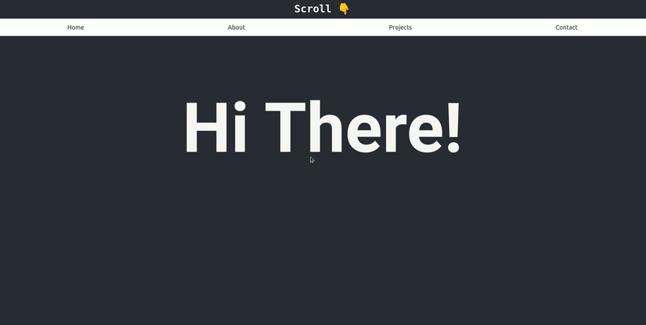

Ou talvez essa?

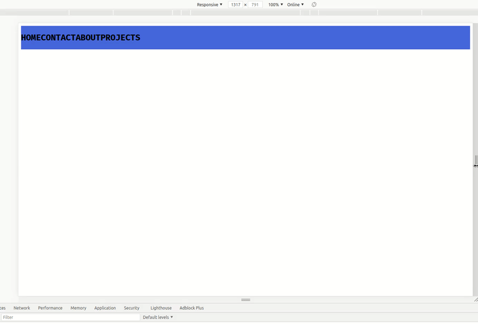

E é isto que estamos construindo hoje!

Vamos dar uma olhada abaixo?

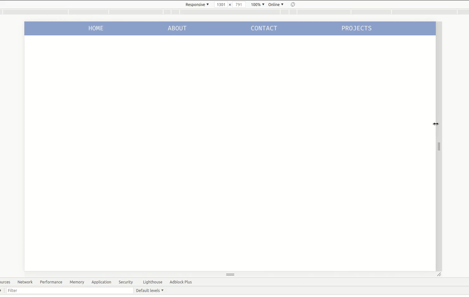


Parte 1: Pré-requisitos

Você deve ter um conhecimento de iniciante em:

HTML
CSS
JavaScript

Parte 2: Configuração

**Configurando seu ambiente de código no Repl.it**

Repl.it é um editor de código online. Você não precisa usar o Repl.it, mas sugiro que faça pelo mesmo, já que ele configura tudo pra você e não precisa de instalação.

Para começar, acesse https://repl.it/languages/html. Seu ambiente de codificação irá girar em apenas alguns segundos!

Você deve ver algo como o seguinte:

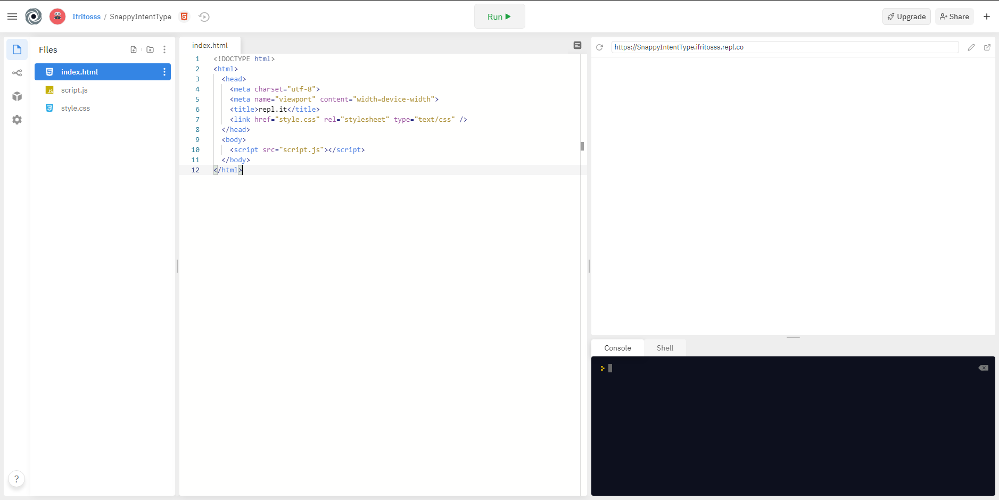

Parte 3: Construindo o projeto

1) HTML
Vamos começar a escrever o código HTML exigido no arquivo index.html. Escreveremos todo nosso código dentro das etiquetas ```<body></body>```.

NOTA: Certifique-se de que a tag ``<script>``, que está em seu “body”, esteja logo acima do fechamento da tag ``</body>`` e qualquer código que você escreva no ``<body>`` deve estar acima daquele ``<script>``, caso contrário, o código dará erro.

Primeiro, vamos construir uma estrutura simples da barra de navegação:

```
<body>
  <nav class="navbar">
    <ul class="elements">
      <li class="nav-el">PRINCIPAL</li>
      <li class="nav-el">SOBRE</li>
      <li class="nav-el">CONTATO</li>
      <li class="nav-el">PROJETOS</li>
    </ul>
  </nav>
  <script src="script.js"></script>
</body>
```

Explicação: No elemento ``<nav>``, criamos uma lista não-ordenada (``<ul>``) com os itens da lista (``<li>``) como links de navegação

Além disso, o elemento ``<nav>`` tem uma classe de barra de navegação ( ``<navbar>`` ), o ``<ul>`` tem uma classe de elementos, o ``<li>`` tem uma classe de nav-el e como sempre, o ``<script>`` tag está abaixo de todas estas linhas.

Agora, vamos também criar um botão que só será visível para telas menores e fará com que a barra de navegação apareça de lado. Ele virá abaixo da lista não ordenada dentro do elemento ``<nav>``.

```
<div class="botão">
  <div class="rows">
    <div class="span"></div>
    <div class="span"></div>
    <div class="span"></div>
  </div>
</div>
```

Explicação: As linhas de botão serão aninhadas dentro de duas tags ``<div>``. Da mesma forma, a primeira tag ``<div>`` tem uma classe de botão, a segunda tag ``<div>`` tem uma classe de fileiras e cada uma das linhas do botão tem uma classe de vão.

Se você executar o código agora, você verá uma lista não ordenada na visualização semelhante a esta:

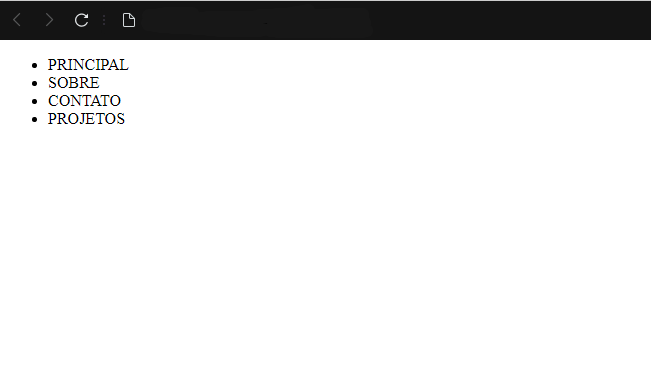

Umm... Por que nosso botão não renderizou? Isso porque sua largura e altura padrão são de 0 pixels. Precisaremos especificar seu tamanho no CSS.

O código HTML até agora:

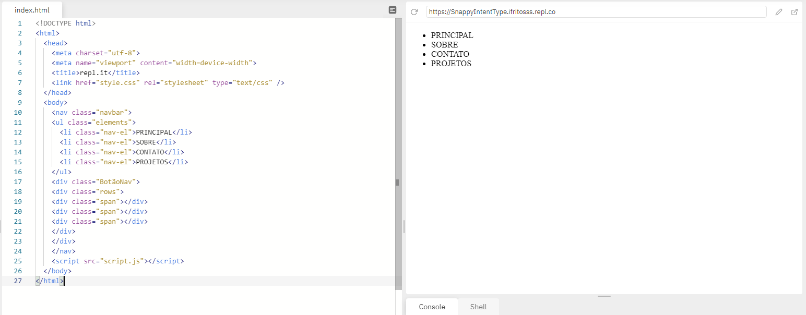

Sem mais delongas, vamos passar para o CSS!

2) CSS
Navegue até o arquivo style.css e vamos começar removendo a margem padrão e o estofamento padrão de todos os elementos. Para fazer isso, vamos simplesmente escrever:

```
* {
  margin: 0;
  padding: 0;
}
```

Em seguida, estilizaremos o ``<ul>`` para que se pareça mais com uma barra de navegação e não com uma lista.

A tag ``<ul>`` foi dada uma classe de elementos. Portanto, daremos estilo à classe de elementos.

```
.elements {
  display: flex;
  justify-content: space-evenly;
  list-style: none;
  padding-top: 10px;
  padding-bottom: 10px;
  color: whitesmoke;
  font-weight: 500;
  font-size: 20px;
  background-color: #89a0ce;
  transition: 0.5s cubic-bezier(0.075, 0.82, 0.165, 1);
}
```

Opa. Muito CSS de uma só vez, certo? Não se preocupe, eu lhe explicarei tudo linha por linha.

**Explicação:** Fazemos a exibição desse elemento para flexioná-lo de modo que possamos alinhá-lo horizontalmente. Em seguida, damos uma propriedade de conteúdo justificado: space-evenly; para que o conteúdo dentro dos elementos seja espaçado adequadamente.

Uma explicação elaborada do conteúdo justificado e suas diversas propriedades:

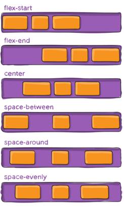

Créditos de imagem: [css-tricks](https://www.css-tricks.com){:target="_blank"}

A seguir, temos o list-style: none; o que removerá os pontos marcados por padrão para listas não-ordenadas. Em seguida, damos ao elemento algum espaço extra em cima e em baixo usando a padding-top: 10px; e padding-bottom: 10px;

Em seguida, são definidas as propriedades de cor, peso da fonte e tamanho da fonte que afetarão o texto dentro do elemento. A background-color: #89a0ce; a propriedade é praticamente auto-explicativa. Em seguida, damos-lhe algumas propriedades de transição de 0,5 segundos como duração da transição e o efeito de transição como cubic-bezier.

Aprenda sobre o cubic bezier.

Em seguida, adicionaremos algumas propriedades CSS ao botão, fileiras e span respectivamente.

```
.rows {
  cursor: pointer;
}

.span {
  width: 30px;
  height: 4px;
  background-color: black;
  margin-bottom: 5px;
  border-radius: 2px;
  transition: 0.5s cubic-bezier(0.23, 1, 0.320, 1);
}
```

**Explicação:** O elemento “rows” tem uma propriedade do cursor definida como ponteiro, assim, sempre que você passar o mouse sobre esse elemento, seu cursor mudará para ponteiro. A seguir, as linhas do botão ``(span)`` têm uma largura de 30px e uma altura de 4px. Ela também tem uma cor de fundo preta, depois tem uma margem de fundo de 5px e uma borda-radius de 2px para obter aquele acabamento suave. Também, como acima, tem uma propriedade de transição - 0,5 segundos de duração e cubic-bezier é o tipo de efeito aplicado a ele.

Vamos clicar em 'RUN' e testá-lo!

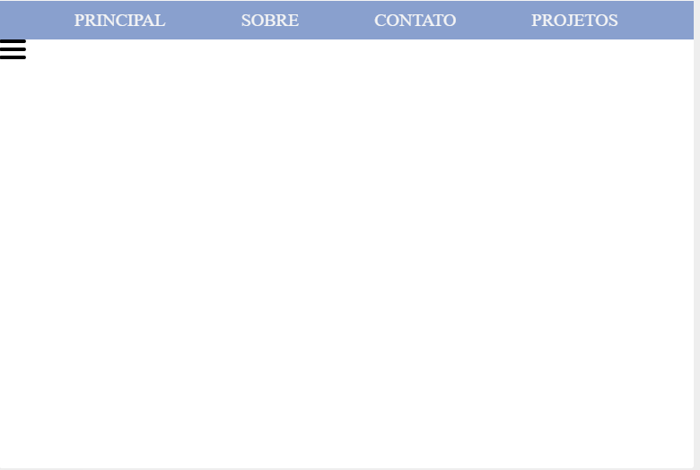

Aqui, você pode ver a lista na forma de barra de navegação e também pode ver o botão. Note que quando você pairar sobre ele, seu cursor mudará para ponteiro.

Além disso, não queremos que o botão seja exibido agora, portanto, vamos fazer com que ele seja display: none;

```
.botão {
  display: none;
}
```

O código CSS está assim até agora:
```
* {
  margin: 0;
  padding: 0;
}

.elements {
  display: flex;
  justify-content: space-evenly;
  list-style: none;
  padding-top: 10px;
  padding-bottom: 10px;
  color: whitesmoke;
  font-weight: 500;
  font-size: 20px;
  background-color: #89a0ce;
  transition: 0.5s cubic-bezier(0.075, 0.82, 0.165, 1);
}

.rows {
  cursor: pointer;
}

.span {
  width: 30px;
  height: 4px;
  background-color: black;
  margin-bottom: 5px;
  border-radius: 2px;
  transition: 0.5s cubic-bezier(0.23, 1, 0.320, 1);
}

.botão {
  display: none;
}
```
A seguir, acrescentaremos uma consulta à mídia. Agora, o que são perguntas da mídia? As consultas de mídia são úteis quando você deseja modificar seu site ou aplicativo, dependendo das características e parâmetros específicos de um dispositivo (como a resolução da tela ou a largura da porta de visualização do navegador). A largura normal de um dispositivo móvel é um pouco 450px.

Portanto, podemos escrever a consulta de mídia de tal forma:

```
@media (max-width: 450px) {

}
```

Aprenda mais em: [media-queries](https://developer.mozilla.org/pt-BR/docs/Web/Guide/CSS/CSS_Media_queries){:target="_blank"}

Agora, todos os estilos que são objeto desta consulta só serão aplicados quando a condição de ``max-width:450px`` for verdadeira.

Aqui, faremos nossa barra de navegação vertical em vez de horizontal e a empurraremos para fora da tela.

```
@media (max-width: 450px) {
  .elements {
    flex-direction: column;
    align-items: center;
    position: absolute;
    margin: 0;
    padding: 20px;
    width: 35%;
    height: 100%;
    transform: translateX(-100%);
  }
}
```

**Explicação:** Quando a resolução da tela se torna inferior a 450px, estes estilos serão aplicados. Assim, aqui, fazemos a ``flex-direction`` da barra de navegação para a coluna, alinhamos os itens ao centro e fazemos a posição para ``absoluto``  para que possa flutuar um pouco na tela do navegador sem perturbar outros elementos da página.

Todas as margens são removidas e um ``padding`` de 20px é aplicado. A largura é ajustada para 35%, de modo que a largura da tela será de 35%. A altura é de 100%, de modo que a barra de navegação é espalhada verticalmente por toda a página.

É aplicada uma propriedade de transformação que especifica a posição x do elemento na tela. O elemento está -100% na direção x (que está fora da tela).

Agora, se você clicar em 'RUN' e se a largura da janela de visualização for superior a 450px, você verá tudo normal. Tente encolher a janela de visualização e em um ponto, você verá a barra de navegação sair da tela na vertical.

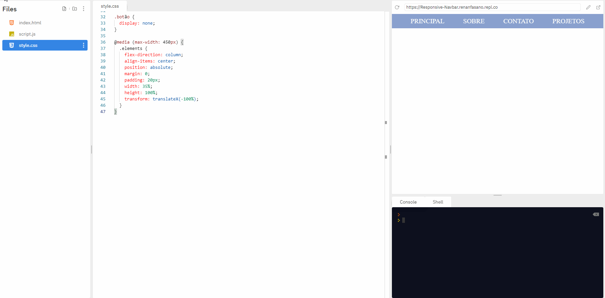

A seguir, também tornaremos o botão visível como está configurado para ``display:none;``

```
@media (max-width: 450px) {
  ... // rest of the code above

  .botão {
    display: flex;
    flex-direction: column;
    align-items: flex-start;
    margin-left: 20px;
    padding-top: 20px;
  }
}
```

Explicação: Quando a resolução da tela fica menor que 450px, ajustamos o display do botão para ``flex``, direcionamos para a coluna e também alinhamos para ``flex-start`` para que fique no canto superior esquerdo da página.

Isso é praticamente tudo para a consulta da mídia, e agora vamos testá-lo. Veremos que o botão aparece no canto e a barra de navegação é deslocada para fora da tela.

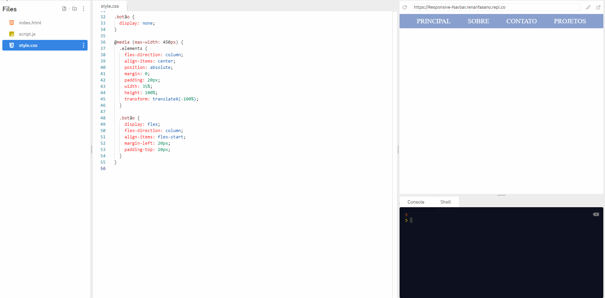

Fora da consulta da mídia, vamos adicionar alguns estilos às classes que nem sequer existem.

Espera... o quê? por quê?
--> Para desperdiçar seu precioso tempo *MUAHAHAHA*.

Ok... Ok... Estava brincando... Essas classes não existentes têm alguma importância. OK? Oh Deus... Não estou desperdiçando seu precioso tempo, pode relaxar...

Vamos começar acrescentando estilos a uma classe chamada ``sidebar``.

```
.sidebar {
  transform: translateX(0px);
}
```

E mais estilos.

```
.line-0 {
  transform: rotate(45deg) translate(4.5px, 12px);
}

.line-1 {
  transform: scale(0);
}

.line-2 {
  transform: rotate(-45deg) translateY(-7.5px);
}
```

E ainda mais estilos!

**Brincadeira**, é só isso 👀

**Explicação:**Lembra que colocamos nossa barra de navegação fora da tela? Sim, então para trazê-la de volta à tela, definimos a classe barra lateral que transformará sua posição x de -100% para 0. Posteriormente, alternaremos esta classe para nossa barra de navegação usando JavaScript.

Além disso, as próximas três classes são definidas com o objetivo de trazer uma animação no botão quando ela é clicada. Giremos a primeira e a terceira linha do botão do hambúrguer para que ele pareça um botão de fechamento (X). A linha do meio fica escondida à medida que a reduzimos para 0. Isto também será alternado usando o JavaScript.

Consulte aqui o código CSS até o momento.

E com dezenas de linhas de código CSS, vamos passar para o JavaScript.

Honestamente, existem apenas cerca de 10 linhas de código. Portanto, aguente firme e não se assuste!

Primeiro vamos ligar a barra de navegação, o botão e cada linha do botão a algumas variáveis. Confuso? Você vai entender daqui a pouco.

```
const nav = document.querySelector(".elements");
const button = document.querySelector(".rows");
const lines = document.querySelectorAll(".span");
```

**Explicação:** A primeira variável nav contém a barra de navegação completa. A segunda variável contém o botão completo.

Note que usamos ``querySelector()`` para as duas primeiras variáveis, mas ``querySelectorAll()`` para a última.

Agora antes de tudo, o que é mesmo uma ``querySelector()``?
A ``querySelector()`` retorna o primeiro elemento dentro do documento que corresponde ao(s) seletor(es) especificado(s).

Assim, a ``querySelectorAll()`` retorna todos os elementos que combinam com o seletor especificado. Da mesma forma, na 3ª linha, todos os elementos com a classe de span são selecionados e são armazenados em uma ``NodeList``.

Agora as ``NodeLists`` são um pouco semelhantes a ``Arrays`` e ``Objetos``, mas eles não são ``Arrays`` ou ``Objetos``. Não precisamos aprofundar, mas se você quiser saber mais sobre isso, dê uma olhada [nisso](https://developer.mozilla.org/pt-BR/docs/Web/API/NodeList){:target="_blank"}.

Então isso significa que todas as 3 linhas de botão estão agora armazenadas na variável ``lines``.

Em seguida, criaremos uma função ``toggler()`` e alternaremos os estilos e animações (que são armazenados nas classes extras que fizemos).

```
function toggler() {
  nav.classList.toggle("sidebar");
  lines[0].classList.toggle("line-0");
  lines[1].classList.toggle("line-1");
  lines[2].classList.toggle("line-2");
}
```

**Explicação:** A barra de navegação terá uma classe de barra lateral quando a função for chamada pela primeira vez e essa classe será removida quando a função for chamada na próxima vez.

Além disso, como a variável de linhas é uma ``NodeList``, podemos acessar cada elemento da mesma usando seu índice. Assim, a primeira linha de botão é alternada com a classe de ``line-0`` e, da mesma forma, as duas linhas seguintes são alternadas com suas respectivas classes.

Agora, precisamos chamar esta função toda vez que o botão é clicado, então adicionaremos um ``event listener`` no botão fora da função.

``button.addEventListener("click", toggler);``

**Explicação:** Agora, sempre que o botão for clicado, a função ``toggler()`` será chamada.

E com isto, terminamos nosso **projeto!** Confira o que você acabou de construir!

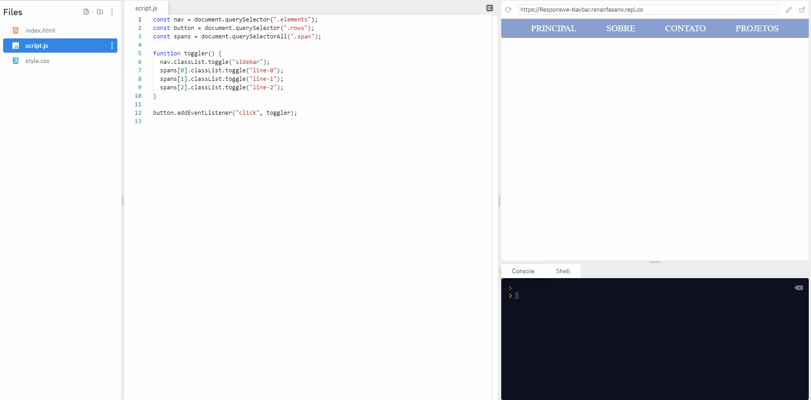

Parte 4: O Fim
Agora eu entrego este projeto a vocês! É totalmente seu agora!

Se você ainda não criou uma conta no [repl.it](https://www.repl.it/), certifique-se de fazê-lo para salvar esta maravilhosa ferramenta de criação!

Se você ainda enfrentar dificuldades para se inscrever, assista [esse](https://www.youtube.com/watch?v=Mtqp4CUepk0){:target="_blank"} video.

Aqui estão algumas coisas que você pode fazer:

  1. Tente atualizar todas as barras de navegação que você já construiu referentes a esta oficina!
  2. Tente implementá-la de tal forma que seja sempre uma barra lateral e não no topo!
  3. Tente fazer a barra de navegação saltar de cima ou de baixo, ao invés de vir da esquerda.
  4. Tente pensar em idéias mais originais sobre como você pode melhorar este projeto.

**Alguns outros exemplos pra você!**

  * [Exemplo de barra lateral](https://repl.it/@FaisalSayed1/Responsive-Navbar-Example-1){:target="_blank"}.
  * [Barra pulando de cima exemplo 1](https://repl.it/@FaisalSayed1/Responsive-Navbar-Example-2){:target="_blank"}.
  * [Barra pulando de cima exemplo 2](https://repl.it/@FaisalSayed1/Responsive-Navbar-Example-3){:target="_blank"}.

Agora que você terminou de construir este maravilhoso projeto, você deve compartilhar sua bela criação com outras pessoas! Lembre-se, é tão fácil quanto enviar a sua URL pra eles!

Você provavelmente conhece as melhores maneiras de entrar em contato com seus amigos e familiares, mas se você quiser compartilhar seu projeto com a comunidade mundial do Hack Club, não há melhor lugar para fazer isso do que no Slack.

1. Em uma nova aba, abra e siga [estas](https://hackclub.com/slack/){:target="_blank"} instruções para se inscrever em nosso Slack.
2. Depois, poste o link para o canal [#scrapbook](https://hackclub.slack.com/messages/scrapbook){:target="_blank"} para compartilhá-lo com todos! Também me pingando com o que você construiu!

Lembrando que quem criou esse workshop foi o: **@fayd** no Slack!

E traduzido por mim **@Yung** no mesmo. 😎