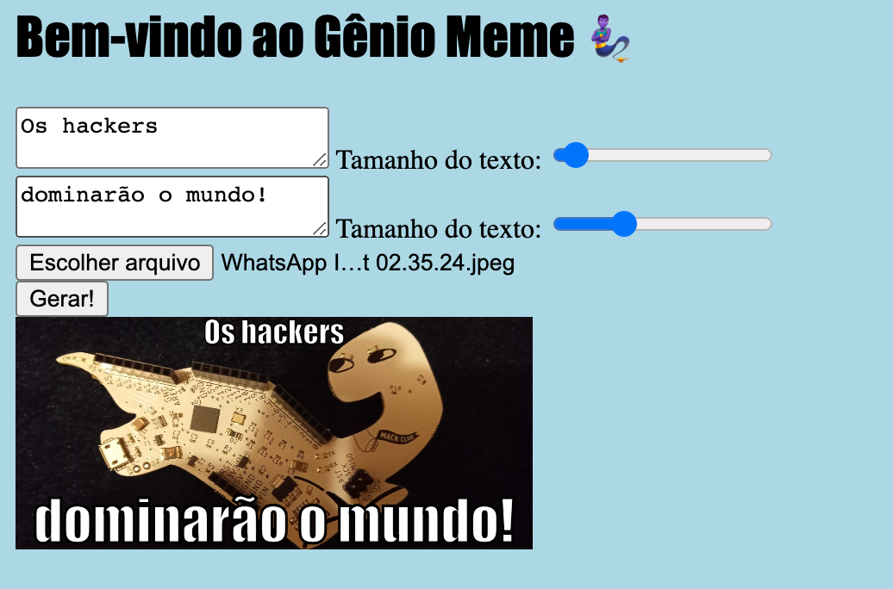
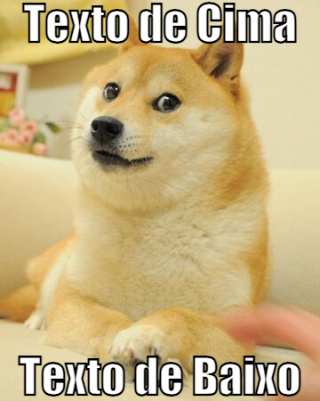
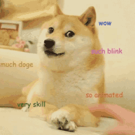

<center>Faça seu próprio gerador de memes com HTML, CSS e JavaScript!</center>  
<center>Feito por <a href="https://github.com/aaryanporwal" target="_blank">@aaryanporwal</a></center>
<center>Traduzido por <a href="https://github.com/adrianoapj" target="_blank">@adrianoapj</a></center>

<br />

Você gosta de memes? Já quis fazer seu próprio, mas não sabia que aplicativo instalar? Não se preocupe, porque neste workshop, você criará seu próprio ***Gerador de Memes*** — ou, como gosto de chamar, o *Gênio Meme*.



Então vamos começar!

O código fonte do projeto pode ser encontrado [aqui](https://repl.it/@adrianoapj/gerador-de-memes).

## Parte 1: Pré-Requisitos

Conhecimento básico de:

1. HTML
2. CSS
3. JavaScript

## Parte 2: Configurando o Ambiente

Nós estaremos utilizando um editor de código online chamado [repl.it](https://repl.it) para este workshop.

Para começarmos, vá para [https://repl.it/languages/html](https://repl.it/languages/html). Seu ambiente de desenvolvimento vai aparecer em poucos segundos!


## Part 3: Construindo o Projeto

### 1) HTML

Vamos começar fazendo uma estrutura para o nosso site gerador de memes.

**Nós estaremos escrevendo todo o código abaixo dentro da tag `<body>`.**

* Primeiramente, adicione um título à página com uma tag `<h1>`:

  ```html
  <h1>Bem-vindo ao Gênio Meme 🧞</h1>
  ```

* Agora desejamos que nossos memes tenham 2 campos de texto: ***Texto de Cima*** e ***Texto de Baixo***, parecido com isso:

    

    Para fazermos isso, utilizaremos duas tags `<textarea>` após nossa tag `<h1>`:

    ```html
    <textarea id="texto-cima"></textarea>
    <textarea id="texto-baixo"></textarea>
    ```

    Agora queremos controles deslizantes para definir o tamanho tanto do texto de cima, quanto do texto de baixo. Para isso, utilizaremos o elemento HTML [`<input type="range">`](https://developer.mozilla.org/pt-BR/docs/Web/HTML/Element/input/range). Adicione os seguintes inputs abaixo de cada `<textarea>`, como mostrado abaixo:

    ```html
    <textarea id="texto-cima"></textarea>
    Tamanho do texto: <input type="range" id="tamanho-texto-cima" min="0.05" max="0.25" value="0.15" step="0.01">
    ```

    ```html
    <textarea id="bottom-text"></textarea>
    Text size: <input type="range" id="tamanho-texto-baixo" min="0.05" max="0.25" value="0.15" step="0.01">
    ```

    Aqui, `min` é o tamanho mínimo do texto, `max` é o tamanho máximo do texto, `value` é o valor padrão e o argumento `step` é o intervalo entre cada seção do controle deslizante, controlando a precisão do mesmo.

* Depois disso, nós precisamos ser capazes de inserir um modelo para o meme dentro de um input do tipo `file`. Para isso, utilizaremos tags `<input>`, especificando que só desejamos receber imagens:
  
  ```html
  <input type="file" id="imagem-input" accept="image/*">
  ```

    Isso adicionará em nosso site um botão que permitirá ao usuário fazer upload de uma imagem para usar de modelo para o meme.

* Agora precisamos de um botão `Gerar`:

    ```html
    <button id="botao-gerar">Gerar!</button>
    ```

* Certo, mas nós também precisamos de algo para mostrar o meme, correto?

    Para isso, utilizaremos um [Canvas do HTML5](https://developer.mozilla.org/pt-BR/docs/Web/API/Canvas_API):

    ```html
    <canvas id="canvas-meme" title="Clique com o botão direito para salvar o meme"></canvas>
    ```

Nosso código HTML até agora:

```html
<!DOCTYPE html>
<html>
  <head>
    <meta charset="utf-8">
    <meta name="viewport" content="width=device-width">
    <title>Gerador de Memes</title>
    <link href="style.css" rel="stylesheet" type="text/css" />
  </head>
  <body>
    <h1>Bem-vindo ao Gênio Meme 🧞</h1>

    <textarea id="texto-cima"></textarea>
    Tamanho do texto: <input type="range" id="tamanho-texto-cima" min="0.05" max="0.25" value="0.15" step="0.01">

    <textarea id="texto-baixo"></textarea>
    Tamanho do texto: <input type="range" id="tamanho-texto-baixo" min="0.05" max="0.25" value="0.15" step="0.01">

    <input type="file" id="imagem-input" accept="image/*">

    <button id="botao-gerar">Gerar!</button>

    <canvas id="canvas-meme" title="Clique com o botão direito para salvar o meme"></canvas>

    <script src="script.js"></script>
  </body>
</html>
```

Agora se você rodar o website clicando no botão verde escrito "Run" no topo da página, você perceberá que os elementos estão um pouco estranhos, parecido com isso:


Para resolver esse problema, temos a tag `<div>` que utilizaremos para separar os elementos diferentes!

Então separe todos os elementos diferentes dentro de tags `<div>`, deixando parecido com isso:

```html
<!DOCTYPE html>
<html>
  <head>
    <meta charset="utf-8">
    <meta name="viewport" content="width=device-width">
    <title>Gerador de Memes</title>
    <link href="style.css" rel="stylesheet" type="text/css" />
  </head>
  <body>
    <h1>Bem-vindo ao Gênio Meme 🧞</h1>

    <div>
      <textarea id="texto-cima"></textarea>
      Tamanho do texto: <input type="range" id="tamanho-texto-cima" min="0.05" max="0.25" value="0.15" step="0.01">
    </div>

    <div>
      <textarea id="texto-baixo"></textarea>
      Tamanho do texto: <input type="range" id="tamanho-texto-baixo" min="0.05" max="0.25" value="0.15" step="0.01">
    </div>

    <div>
      <input type="file" id="imagem-input" accept="image/*">
    </div>

    <div>
      <button id="botao-gerar">Gerar!</button>
    </div>

    <canvas id="canvas-meme" title="Clique com o botão direito para salvar o meme"></canvas>

    <script src="script.js"></script>
  </body>
</html>
```

Agora rode o website novamente. Agora ele deve estar parecido com isso:


E com isso terminamos a parte do HTML!

### 2) CSS

Agora, vamos adicionar um pouco de estilização básica ao nosso site. Navegue até o arquivo `style.css` e adicione o seguinte código:

```css
h1 {
  font-family: Impact, 'Arial Narrow Bold', sans-serif;
  font-size: 30px;
}

body {
  margin: 10px;
  background-color: lightblue;
}

#canvas-meme {
  width: 300px;
}
```

Nesse arquivo CSS:

- Nós primeiro modificamos a fonte do título para Impact (a "fonte do meme"), ou para a fonte Arial caso o usuário não tenha a Impact por algum motivo. Então, nós aumentamos um pouco o tamanho do título.
- Depois, nós aplicamos uma cor de fundo ao corpo da página (vulgo a página inteira) e adicionamos um pouco de espaço entre as bordas com a propriedade `margin`.
- Então, nós selecionamos nosso canvas (do qual, como você deve se lembrar, nós demos um `id` `canvas-meme`) utilizando `#` e definindo sua largura para 300px.
  - No CSS, quando você seleciona um elemento, como `h1`, o estilo que você definiu será aplicado a todas as tags `h1` na página. Então se você adicionar outro título, ele também terá 30px e a fonte Impact. Contudo, no caso de `canvas-meme`, nós estamos dizendo no arquivo CSS, para selecionar apenas aquele canvas específico, logo, se adicionarmos outro canvas no futuro, este não teria o mesma estilização aplicada do que o outro canvas.
  - E porque estamos fazendo seleção pelo ID se não temos nenhum outro canvas? Para você aprender a selecionar por IDs! :)

E é isso! Esse é todo o CSS que faremos durante este workshop.

### 3) JavaScript

Você está indo muito bem! Agora, vamos fazer nosso gerador de memes funcionar de verdade, com a ajuda do JavaScript.

Navegue até o arquivo `script.js` e:

* Crie uma função `gerarMeme()` que recebe os parâmetros `img`, `textoCima`, `textoBaixo`, `tamanhoTextoCima`, and `tamanhoTextoBaixo`:
  
  ```javascript
  function gerarMeme(img, textoCima, textoBaixo, tamanhoTextoCima, tamanhoTextoBaixo) {
    // Código aqui
  }
  ```
  
Agora, dentro da função `gerarMeme()`:

  -> 1. Primeiro, inicialize um [`Canvas`](https://developer.mozilla.org/pt-BR/docs/Web/API/Canvas_API/Tutorial/Basic_usage), que vai apontar para o elemento `canvas-meme` do nosso código HTML:
  
  ```javascript
  const canvas = document.getElementById('canvas-meme');
  ```

  Aqui, nós estamos fazendo algo muito legal: nós estamos selecionando um canvas específico que escrevos no nosso arquivo HTML com o ID `canvas-meme`, e agora vamos modificar ele dentro de nosso código JavaScript!

  -> 2. Agora, vamos obter o [contexto de renderização 2D](https://developer.mozilla.org/en-US/docs/Web/API/CanvasRenderingContext2D) do canvas, e para isso chamaremos a função `getContext()` ao selecionar o elemento `<canvas>` do HTML através de seu ID, e fornecendo `'2d'` como parâmetro. Nosso contexto de renderização 2D vai nos fornecer um monte de métodos para estilizar e desenhar em nosso canvas!

  ```javascript
  const ctx = canvas.getContext('2d');
  ```

  -> 3. Agora vamos definir as dimensões do canvas como as mesmas da nossa imagem:

  ```javascript
  canvas.width = img.width;
  canvas.height = img.height;
  ```

  -> 4. Agora, utilizando nosso `contexto de renderização 2D`, limparemos a área de um retângulo, ao apagar os pixels da área definindo-os para preto transparente:
   
  ```javascript
  ctx.clearRect(0, 0, canvas.width, canvas.height);
  ```

  -> 5. Após isso, nós desenharemos a imagem no canvas utilizando a função `drawImage()` disponível através de `context` informando nossa imagem, além das coordenadas X e Y.
   
  ```javascript
  ctx.drawImage(img, 0, 0); // 0, 0 são nossas coordenadas X e Y
  ```

  -> 6. Depois disso, nós definimos o estilo do nosso texto utilizando três funções: `ctx.fillStyle`, `ctx.strokeStyle` e `ctx.textAlign`:
   
  ```javascript
  // Estilo do texto: branco com bordas pretas
  ctx.fillStyle = 'white';
  ctx.strokeStyle = 'black';
  ctx.textAlign = 'center';
  ```

  -> 7. Agora, definiremos o `tamanhoDaFonte`:

  ```javascript
  let tamanhoDaFonte = canvas.width * tamanhoTextoCima; // O tamanho da fonte variará a depender dos controles deslizantes
  ctx.font = `${tamanhoDaFonte}px Impact`; // Utilizaremos a fonte Impact, usada pela maioria dos memes
  ctx.lineWidth = tamanhoDaFonte / 20; // lineWidth será o contorno do tamanho, e estamos definindo-o para a vigésima parte do tamanho de nossa fonte.
  ```

  -> 8. Depois disso, para escrever o texto de cima, nós usamos `ctx.fillText` para preencher o texto e `ctx.strokeText` para o contorno:

  ```javascript
  // Escreve o texto de cima
  ctx.textBaseline = 'top'; // A propriedade textBaseline especifica a linha de base do texto a ser usada ao escrever o texto.
  textoCima.split('\n').forEach((t, i) => {
    ctx.fillText(t, canvas.width / 2, i * tamanhoDaFonte, canvas.width); // fillText recebe 3 argumentos: o primeiro é nosso texto, o segundo e terceiro são respectivamente as coordenadas X e Y de onde o texto deve começar a ser escrito.
    ctx.strokeText(t, canvas.width / 2, i * tamanhoDaFonte, canvas.width); // Os argumentos são os mesmos de fillText, mas strokeText desenha o contorno de nosso texto.
  });
  ```

  -> 9. Agora, vamos repetir os mesmos passos, só que para o texto de baixo:
  
  ```javascript
    // Tamanho da fonte do texto de baixo
    tamanhoDaFonte = canvas.width * tamanhoTextoBaixo;
    ctx.font = `${tamanhoDaFonte}px Impact`;
    ctx.lineWidth = tamanhoDaFonte / 20;

    // Escrever texto de baixo
    ctx.textBaseline = 'bottom';
    textoBaixo.split('\n').reverse().forEach((t, i) => { // .reverse() porque estaremos escrevendo o texto de baixo a começar de baixo, para cima
      ctx.fillText(t, canvas.width / 2, canvas.height - i * tamanhoDaFonte, canvas.width);
      ctx.strokeText(t, canvas.width / 2, canvas.height - i * tamanhoDaFonte, canvas.width);
    });
  } // Fim da nossa função gerarMeme()
  ```

* Agora, após a função `gerarMeme()`, adicione um [Window: DOMContentLoaded](https://developer.mozilla.org/pt-BR/docs/Web/API/Window/DOMContentLoaded_event) *event listener* que vai ouvir o evento `DOMContentLoaded`.

  ```javascript
    window.addEventListener('DOMContentLoaded', () => {
      // Código aqui
    });
  ```
  
  O código dentro da função vai executar apenas após todos os elementos da página serem carregados. Nós precisamos disso porque agora vamos selecionar _uma série_ de elementos na página HTML, e se não tivéssemos isso, o código poderia tentar selecionar elementos que ainda não tivessem sido criados.
  
  Dentro do *EventListener*:

  -> 1. Inicialize as variáveis `textoCimaInput`, `textoBaixoInput`, `tamanhoTextoCimaInput`, `tamanhoTextoBaixoInput`, `imagemInput` e `botaoGerar` utilizando o método `document.getElementById()`:

    ```javascript
      const textoCimaInput = document.getElementById('texto-cima');
      const textoBaixoInput = document.getElementById('texto-baixo');
      const tamanhoTextoCimaInput = document.getElementById('tamanho-texto-cima');
      const tamanhoTextoBaixoInput = document.getElementById('tamanho-texto-baixo');
      const imagemInput = document.getElementById('imagem-input');
      const botaoGerar = document.getElementById('botao-gerar');
    ```

  -> 2. Depois, vamos definir um texto padrão (ou valor) para `textoCimaInput` e `textoBaixoInput`:

    ```javascript
      textoCimaInput.value = 'Valor de\nCima';
      textoBaixoInput.value = 'Valor de\nBaixo';
    ```

  -> 3. Após isso, adicione um *event listener* `click` para `botaoGerar`. O código aí dentro é executado sempre que o botão for clicado.
  
    ```javascript
      botaoGerar.addEventListener('click', () => {
        // Código aqui
      });
    ```

  -> 4. Dentro do `EventListener` do botão, nós vamos usar a [FileReader API](https://developer.mozilla.org/pt-BR/docs/Web/API/FileReader) para ler o modelo do meme do sistema de arquivos como um [DataURL](http://developer.mozilla.org/pt-BR/docs/Web/API/FileReader/readAsDataURL):
  
    ```javascript
      const leitor = new FileReader();
      leitor.readAsDataURL(imagemInput.files[0]);
    ```

  -> 5. Agora, após o FileReader finalizar a leitura do modelo nós desejamos gerar uma nova [`Image`](https://developer.mozilla.org/en-US/docs/Web/API/HTMLImageElement/Image), e a fonte dessa imagem será o resultado do nosso leitor. Após nossa nova imagem ser carregada, nós vamos enviar nossa nova imagem, texto e tamanho de texto para a função `gerarMeme()` para que sejam mostrados em nosso canvas!

    ```javascript
      leitor.onload = () => {
        const img = new Image();
        img.src = leitor.result;
        img.onload = () => {
          gerarMeme(img, textoCimaInput.value, textoBaixoInput.value, tamanhoTextoCimaInput.value, tamanhoTextoBaixoInput.value);
        };
      };
    ```


<details>

  <summary>Código JavaScript final:</summary>

  <div id="final-js-code" markdown="1">

  ```javascript
  function gerarMeme(img, textoCima, textoBaixo, tamanhoTextoCima, tamanhoTextoBaixo) {
    const canvas = document.getElementById('canvas-meme');

    const ctx = canvas.getContext('2d');
    canvas.width = img.width;
    canvas.height = img.height;

    ctx.clearRect(0, 0, canvas.width, canvas.height);
    ctx.drawImage(img, 0, 0); // 0, 0 são nossas coordenadas X e Y

    // Estilo do texto: branco com bordas pretas
    ctx.fillStyle = 'white';
    ctx.strokeStyle = 'black';
    ctx.textAlign = 'center';

    let tamanhoDaFonte = canvas.width * tamanhoTextoCima; // O tamanho da fonte variará a depender dos controles deslizantes
    ctx.font = `${tamanhoDaFonte}px Impact`; // Utilizaremos a fonte Impact, usada pela maioria dos memes
    ctx.lineWidth = tamanhoDaFonte / 20; // lineWidth será o contorno do tamanho, e estamos definindo-o para a vigésima parte do tamanho de nossa fonte.

    // Escreve o texto de cima
    ctx.textBaseline = 'top'; // A propriedade textBaseline especifica a linha de base do texto a ser usada ao escrever o texto.
    textoCima.split('\n').forEach((t, i) => {
      ctx.fillText(t, canvas.width / 2, i * tamanhoDaFonte, canvas.width); // fillText recebe 3 argumentos: o primeiro é nosso texto, o segundo e terceiro são respectivamente as coordenadas X e Y de onde o texto deve começar a ser escrito.
      ctx.strokeText(t, canvas.width / 2, i * tamanhoDaFonte, canvas.width); // Os argumentos são os mesmos de fillText, mas strokeText desenha o contorno de nosso texto.
    });

    // Tamanho da fonte do texto de baixo
    tamanhoDaFonte = canvas.width * tamanhoTextoBaixo;
    ctx.font = `${tamanhoDaFonte}px Impact`;
    ctx.lineWidth = tamanhoDaFonte / 20;

    // Escrever texto de baixo
    ctx.textBaseline = 'bottom';
    textoBaixo.split('\n').reverse().forEach((t, i) => { // .reverse() porque estaremos escrevendo o texto de baixo a começar de baixo, para cima
      ctx.fillText(t, canvas.width / 2, canvas.height - i * tamanhoDaFonte, canvas.width);
      ctx.strokeText(t, canvas.width / 2, canvas.height - i * tamanhoDaFonte, canvas.width);
    });
  }

  window.addEventListener('DOMContentLoaded', () => {
    const textoCimaInput = document.getElementById('texto-cima');
    const textoBaixoInput = document.getElementById('texto-baixo');
    const tamanhoTextoCimaInput = document.getElementById('tamanho-texto-cima');
    const tamanhoTextoBaixoInput = document.getElementById('tamanho-texto-baixo');
    const imagemInput = document.getElementById('imagem-input');
    const botaoGerar = document.getElementById('botao-gerar');

    textoCimaInput.value = 'Valor de\nCima';
    textoBaixoInput.value = 'Valor de\nBaixo';

    botaoGerar.addEventListener('click', () => {
      const leitor = new FileReader();
      leitor.readAsDataURL(imagemInput.files[0]);

      leitor.onload = () => {
        const img = new Image();
        img.src = leitor.result;
        img.onload = () => {
          gerarMeme(img, textoCimaInput.value, textoBaixoInput.value, tamanhoTextoCimaInput.value, tamanhoTextoBaixoInput.value);
        };
      };
    });
  });
  ```
  
  </div>

</details>

**_E com isso, terminamos de programar nosso Gênio Meme! Confira o que você construiu clicando no botão "Run" no topo da página._**


>Nota: Para salvar o meme gerado, você pode clicar com o botão direito no meme e selecionar "salvar como..."

## Parte 4: Hackeando

Agora que terminamos de construir um site bem básico, podemos adicionar um monte de coisas legais a ele!

Aqui vão algumas sugestões do que você pode adicionar:

1. Tente adicionar um [seletor de cores](https://developer.mozilla.org/pt-BR/docs/Web/HTML/Element/input/color), para que o usuário possa mudar a cor do textoCima/textoBaixo.
2. Adicione o recurso arrastar e soltar, utilizando a [API de Drag and Drop do HTML5](https://web.dev/drag-and-drop/).
3. Utilize [Flexbox](https://developer.mozilla.org/pt-BR/docs/Learn/CSS/CSS_layout/Flexbox) criar um layout bacana.
4. Utilize uma API a fim obter modelos para memes, como o disponibilizado pela [ImgFlip](https://imgflip.com/api).
5. Adicione botões de baixar e compartilhar para mostrar a todos seu meme incrível!

## Parte 5: O Fim

Se você não criou uma conta no [repl.it](https://repl.it), o faça para que você consiga salvar essa sua maravilhosa criação!

Se você está tendo problemas para se cadastrar, fale com um líder de seu clube ou com alguém no [Slack do Hack Club](https://hackclub.com/slack)!

### Alguns Outros Exemplos

* [Ninivert](https://codepen.io/ninivert/pen/BpLKRx)
* [Gerador de Memes da Vox Media](https://github.com/voxmedia/meme)
* [Gerador de Memes da Salt Bay](https://codepen.io/yelly/pen/demrxp)

### Veja o que Outros Hackers do Hack Club fizeram

* [Sam Poder](https://beautiful-languid-passive.glitch.me/) usou a API Unsplash para obter a imagem baseado no texto de baixo!
* [Khushraj Rathod](https://repl.it/@aaryanporwal/MemeGenie#index.html) construiu um gerador de memes que utiliza a API ImgFlip para obter modelos de memes aleatórios!

### Parte 6: Compartilhando com a Comunidade



Agora que você terminou de construir um projeto incrível, você deveria compartilhar ele com seus amigos ou com o mundo todo através da comunidade do Hack Club!

Em uma nova janela, abra e acesse [esse](https://slack.hackclub.com/) site para se inscrever no nosso Slack. Então poste o que você criou no canal `#ship` para compartilhar com todos o que você fez!

P.S Eu sou o @Aaryan Porwal no Slack do Hack Club.