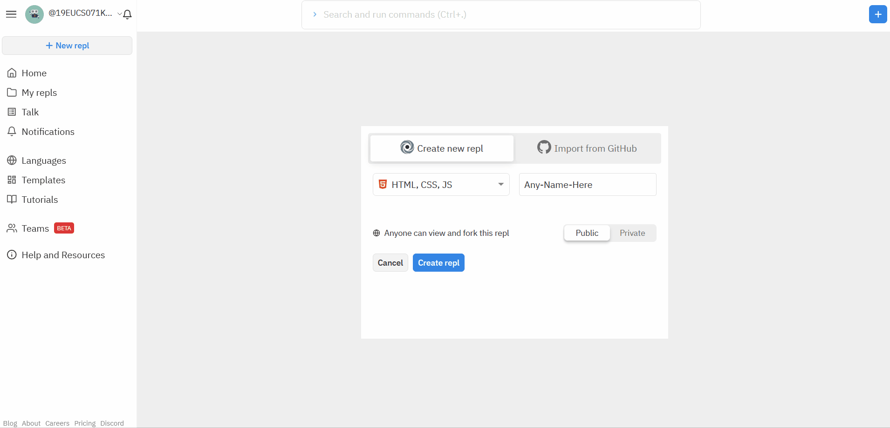
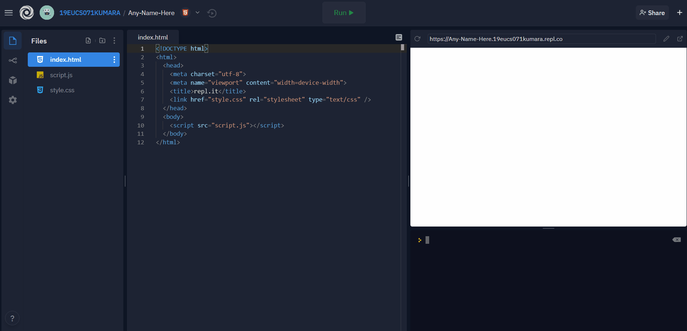
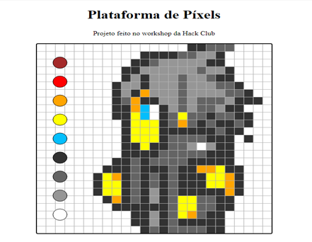
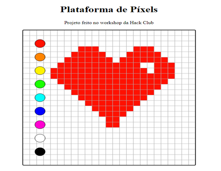

---

title: 'Plataforma de arte em píxels'
description: 'Construa uma plataforma de arte em pixel usando HTML e Java'
bg-image: "/workshops/plataforma-de-pixel-art/img/fundo-hc.png"
permalink: /workshops/arte-em-pixel/
order: 30

---

<center>Crie uma plataforma de píxel art usando HTML e Java!</center>  
<center> Feito por <a href="https://github.com/hackyguru" target="_blank">@hackyguru</a> </center>
<center>Traduzido por <a href="https://github.com/Ifritosss" target="_blank">@Ifritosss</a></center>

<br />

Java ganhou um pouco de reputação negativa entre os jovens. Afinal, muitas aulas universitárias e até mesmo as aulas de computação nas escolas secundárias introduzem os iniciantes no mundo da programação, ensinando-os a escrever aplicativos de computador chatos e ultrapassados usando Java. Mas só porque as aulas de ciência da computação tornam o Java entediante, não significa que tenha que ser! Neste workshop, você vai usar Java como uma ferramenta para a programação criativa na web, criando sua própria plataforma de arte em pixels.

Aqui está um exemplo de como ficará:

[](https://pixel-art-pad.renanfasano.repl.co/){:target="_blank"}

[Demonstração Online][final_live_demo]{:target="_blank"}
<br />

[Código Final][final_code]{:target="_blank"}

[final_live_demo]: https://pixel-art-pad.renanfasano.repl.co
[final_code]: https://repl.it/@RenanFasano/Plataforma-de-Pixels
[repl_it]: https://repl.it

Esse workshop levará cerca de 45 minutos pra ser finalizado.

## Parte 1: Um Termo de Responsabilidade

Antes de começarmos, uma informação importante. Leia, **especialmente se você é novo em programação!**

O objetivo deste workshop é se divertir um pouco com Java, fazendo algo divertido no navegador com ele. Para fazer isso, vamos ter que usar Java de maneiras que não deveriam ser usadas e empregar algumas práticas muito ruins. **Você não deve escrever websites e aplicativos web em Java.** Os desenvolvedores escrevem código para a web usando outra linguagem chamada JavaScript, que, apesar de seu nome soar similar ao Java, *é uma linguagem completamente diferente*. JavaScript é uma linguagem de script para adicionar funcionalidade a websites, destinada a ser executada no navegador; Java é uma linguagem destinada a escrever aplicações mais complexas, como aplicativos desktop.

Estamos quebrando as regras neste workshop - mas quebrar as regras sem entendê-las completamente primeiro é perigoso e pode potencialmente ser uma grande fonte de confusão em sua jornada de programação no futuro. Portanto, se você for um iniciante fazendo este workshop sozinho, recomendo que primeiro tente alguns outros workshops que façam projetos igualmente legais sem empregar más práticas. Você pode ver alguns dos meus favoritos, expandindo a queda sob este parágrafo. Se você é um líder de clube que está dirigindo este workshop para iniciantes, certifique-se de saber o que você está fazendo.

Alguns dos outros workshops bem criativos:

-> [Respingos de Tinta](https://hackclubbrasil.com.br/workshops/respingos-tinta/){:target="_blank"} <br />

-> [Fale Cores](https://hackclubbrasil.com.br/workshops/fale-cores/){:target="_blank"} <br />

-> [Galáxia de Som](https://hackclubbrasil.com.br/workshops/galaxia-de-som/){:target="_blank"} <br />

-> [Sintetizador](https://hackclubbrasil.com.br/workshops/sintetizador/){:target="_blank"} <br />

-> [Modelos Animados 3D](https://hackclubbrasil.com.br/workshops/modelos-3d/){:target="_blank"} <br />

-> [Sintonia com JS](https://hackclubbrasil.com.br/workshops/sintonia/){:target="_blank"} <br />

<br />
Agora que isso está claro, vamos começar!

## Parte 2: Pré-requisitos

Este workshop pressupõe que você tenha uma compreensão básica de Java, inclusive:

- o conceito de programação orientada a objetos e como você pode trabalhar com objetos em Java
- definindo uma classe e construtor
- métodos e tipos de retorno

Incluí alguns trechos explicando alguns conceitos de Java que encontramos ao longo de todo o processo caso você esteja um pouco enferrujado, mas se você não tiver uma compreensão básica destes conceitos, você pode se perder.

Também ajuda a ter uma compreensão básica de HTML, mas não é necessário.

Estaremos usando uma biblioteca chamada Processing.js, o que torna super fácil escrever código criativo na web.

## Parte 3: Começando

### Configurando o Repl.it

Vamos escrever nosso código em um editor de código online chamado [Repl.it](https://repl.it){:target="_blank"}. Para começar, vá para [https://repl.it/languages/html](https://repl.it/languages/html){:target="_blank"}. Seu ambiente de programação será criado dentro de alguns instantes.

{:target="_blank"}

Uma vez que seu projeto estiver pronto, você estará pronto para continuar!

## Parte 4: Configurando os arquivos requeridos

### 1) Eliminando arquivos desnecessários

Quando sea projeto for iniciado, você deve ver 3 arquivos na barra lateral à esquerda: `index.html`, `style.css`, e `script.js`. Exclua `style.css` e `script.js`. Não vamos utilizá-los para este workshop.

{:target="_blank"}

### 2) Criando o arquivo Java

Como mencionado anteriormente, vamos escrever a funcionalidade para o bloco de pixel art em Java. Então, vamos criar um arquivo chamado `index.java` clicando no ícone "Add File" na parte superior da barra lateral.

{:target="_blank"}

Agora você deve ter dois arquivos chamados `index.html` e `index.java`.

## Parte 5: Construindo a Plataforma de Píxel Art

#### 1) index.html

Primeiro, vamos escrever o código HTML necessário para o painel de píxel art. Repl.it já deve ter adicionado algum código inicial ao arquivo `index.html`:

```html
<!DOCTYPE html>
<html>
  <head>
    <meta charset="utf-8">
    <meta name="overview" content="width=device-width">
    <title>repl.it</title>
    <link href="style.css" rel="stylesheet" type="text/css" />
  </head>
  <body>
    <script src="script.js"></script>
  </body>
</html>
```

Substitua o texto dentro da tag `<title>` pelo título que você deseja. No meu caso, estou substituindo-o por:

```html 
<title>Plataforma de Arte em Píxels</title>
```

A seguir, como não vamos escrever CSS neste workshop, você pode remover a linha que liga o arquivo CSS ao arquivo HTML. Apague a linha que se parece com esta:

```html
<link href="style.css" rel="stylesheet" type="text/css" />
```

Da mesma forma, uma vez que não temos mais um arquivo JavaScript para ligar, você também pode remover esta linha:

```html
<script src="script.js"></script>
```

Finalmente, vá em frente e apague tudo entre as tags `<body>` `</body>` e substitua por isso:

```html
<body>
  <center>
    <h1>Plataforma de Píxels</h1>
    <br>
    <canvas data-processing-sources="index.java"></canvas>
  </center>
  <script src="https://cdnjs.cloudflare.com/ajax/libs/processing.js/1.6.6/processing.min.js"></script>
</body>
```

Aqui, nós estamos:

- adicionando um título (`<h1>`) ao topo da página.
- adicionando uma quebra de linha (`<br>`).
- criando um [HTML Canvas](https://developer.mozilla.org/pt-BR/docs/Web/Guide/HTML/Canvas_tutorial){:target="_blank"} e ligando nosso arquivo Java a ele (é aqui que aparecerá nosso bloco de pixel art!).
- embrulhando tudo em uma tag `<center>` para que possamos centralizar tudo sem ter que escrever CSS. O `<center>` é um elemento obsoleto e você não deve utilizá-lo em seus próprios projetos, mas no espírito de hackear nosso caminho para uma solução sem considerar uma má prática, estamos utilizando-o neste projeto.
- importando a biblioteca Processing.js, que utilizaremos para criar nossa base de pixel art.

#### código final index.html:

```html
<!DOCTYPE html>
<html>
  <head>
    <meta charset="utf-8">
    <meta name="exibição" content="width=device-width">
    <title>Título do Projeto</title>
  </head>
  <body>
    <center>
      <h1>Plataforma de Píxels</h1>
      <br>
      <canvas data-processing-sources="index.java"></canvas>
    </center>
    <script src="https://cdnjs.cloudflare.com/ajax/libs/processing.js/1.6.6/processing.min.js"></script>
  </body>
</html>
```

E é isso! Terminamos de escrever nosso HTML.

### 2) index.java

#### A classe Ladrilho

Agora que já escrevemos nosso HTML, é hora de escrever o código Java que dará vida ao nosso bloco de pixel art.

No arquivo `index.java`, crie uma classe chamada `Ladrilho` com o seguinte código:

```java
class Ladrilho
{
  int x, y;
  color cor;
  
  boolean espalhado;
  
  Ladrilho(int x, int y, int cor)
  {
    this.x = x;
    this.y = y;
    this.cor = cor;
    
    espalhado = false;
  }
}
```

Aqui, estamos configurando que a classe `Ladrilho` precisa ser inicializada com duas variáveis inteiras `x` e `y`, uma variável que define uma cor, e uma variável booleana.

*No caso de você ser novo em Java: o aspecto estranho da função que começa com `Ladrilho(int x, int y, int color)` é chamado de [construtor](https://www.devmedia.com.br/construtores-em-java-primeiros-passos/28618){:target="_blank"}.*

Abaixo da classe construtora `Ladrilho`, mas dentro da classe `Ladrilho`, crie um método chamado `Mostrar()`.

```java
void Mostrar()
{ 
  fill(cor);

  if (!mostrar) noStroke();
  else stroke(180);

  rect(x * 20, y * 20, 20, 20);
}
```

Este método utiliza algumas funções úteis-`fill()`, `noStroke()`, `stroke()`, e `rect()`- da biblioteca Processing.js para exibir a classe `ladrilho`. Como regra geral ao longo deste workshop, se você vir uma função aleatória que não tenha sido escrita anteriormente aparecer subitamente no código, provavelmente é da Processing.js. Recomendo ter a [Documentação do Processing.js](https://pt.khanacademy.org/computing/computer-programming/pjs-documentation){:target="_blank"} aberta em outra aba para que você possa descobrir o que cada função faz se estiver curioso.

#### Se você é novo na área de Java:

Todos os métodos Java devem especificar um "tipo de retorno", ou o tipo de variável que a função "retornará", uma vez concluída. Por exemplo, se você quisesse escrever um método que acrescentasse dois números, eis como ele ficaria:
<br />

```java
int adicionarNum(int a, int b) {
  return a + b // como a e b são inteiros, o tipo de retorno é um inteiro também, que é consistente com o tipo de retorno declarado
}
```
<br />

E se você quisesse escrever um método que combinasse duas palavras, ele se pareceria com algo assim:

```java
String combinaStrings(String a, String b) {
  return a + b
}
```

Nossa função `Mostrar()` tem tipo de retorno é `void` (vazio), o que significa que não retorna nada.

#### Especificando o tamanho da grade

E com isso, sua classe `Ladrilho` está completa! Agora, vamos trabalhar com ela.

Após o final da classe `Ladrilho`, acrescente:

```java
Ladrilho grid[][] = new Ladrilho[25][25];
```

Isto inicializa um grid quadrado de 25x25 ladrilhos.<br /> *Quando finalizar esse workshop, volte e tente mudar estes números para a quantidade que quiser!*

#### Especificando as cores na paleta de cores

{:target="_blank"}

Vamos adicionar as opções de cores que vamos querer usar para a plataforma. Vou lhe dar 9 cores para começar, mas recomendo que escolha suas próprias cores! pesquise no Google "rgb color picker" e você encontrará uma ferramenta que lhe permitirá escolher uma cor e obter seu valor RGB.

Abaixo do objeto "Ladrilho", adicione:

```java
color cores[] = {
  color(255, 17, 0),
  color(255, 132, 0),
  color(255, 242, 0),
  color(26, 255, 0),
  color(0, 255, 251),
  color(0, 0, 255),
  color(255, 0, 208),
  color(255),
  color(0)
};

color selecao = color(255);
boolean mostrar = true;
```

#### a função `setup()`

O processamento inclui duas funções principais:

- `setup()`, que é executada uma vez quando você executa seu código pela primeira vez e é destinado à configuração de sua tela
- `setup()`, que funciona continuamente e é destinada a fazer as coisas acontecerem em sua tela

Depois da parte anterior do código que você acabou de escrever, acrescente:

```java
void setup()
{

}
```

Agora, vamos inicializar os quadrados em nossa tela:

```java
void setup()
{
  size(500, 500);
  
  for (int a = 0; a < grid.length; ++a)
  {
    for (int b = 0; b < grid[a].length; ++b)
      grid[a][b] = new Ladrilho(a, b, color(255));
  }
}
```

Neste código:

- Primeiro, definimos o tamanho da tela de 500 pixels por 500 pixels. Você é bem-vindo a mudar isto se quiser!
- Em seguida, fazemos um loop através da grade de 'Ladrilho' que acabamos de criar e adicionamos um novo objeto `Ladrilho`, da cor branca.

#### A função `draw()`

Abaixo da função `setup()`, adicione a função `draw()`:

```java
void draw()
{

}
```

Então, dentro da função, adicione o seguinte código:

```java
void draw()
{ 
  for (int a = 0; a < grid.length; ++a)
  {
    for (int b = 0; b < grid[a].length; ++b)
      grid[b][a].Mostrar();
  }
  
  if (mostrar)
  {
    for (int a = 0; a < cores.length; ++a)
    {
      fill(cores[a]);
      stroke(0);
      ellipse(50, (a * 50) + 50, 30, 30);
    }
  }
}
```

Lembre-se de que a função `draw()` funciona continuamente. Aqui, estamos chamando o método `Mostrar()`em cada `Ladrilho`. Em seguida, exibimos cada opção de cor perto da esquerda da tela.

#### Respondendo à entrada do mouse

Quando o usuário clica em um píxel, ele quer uma de duas coisas:

1. Selecionar uma cor
2. Desenhar sobre um píxel

Vamos escrever um pouco de código que desenha em um píxel quando o usuário clicar nele. No final da função `draw()`, mas antes da mesma ser fechada, adicione o seguinte código:

```java
if (mousePressed && mouseButton == LEFT)
{
  for (int a = 0; a < grid.length; ++a)
  {
    for (int b = 0; b < grid[a].length; ++b)
    {
      if (mouseX >= (b * 20) && mouseX <= 20 + (b * 20) && mouseY >= (a * 20) && mouseY <= 20 + (a * 20))
      {
        if (mostrar)
        {
          for (int c = 0; c < cores.length; ++c)
          {
            if (dist(mouseX, mouseY, 50, (c * 50) + 50) <= 30)
              return;
          }
        }

        grid[b][a].cor = selecao;
      }
    }
  }
}
```

Uau! Confira todos esses loops e declarações. Veja com atenção este trecho de código. Você entende o que ele está fazendo? É um pouco difícil e pode embrulhar sua cabeça, então se não entender, continue lendo e eu lhe mostrarei como ele funciona.

#### Selecionando uma cor

Estamos quase terminando! Há apenas mais uma coisa que precisamos fazer: agora mesmo, você poderá desenhar, mas não poderá selecionar uma cor. Então, vamos acrescentar isso.
  
Depois da função `draw()`, no final do arquivo, adicione uma função chamada `mousePressed()`:

```java
void mousePressed()
{

}
```

`mousePressed()` É uma função fornecida pelo nosso **Processing.js**. O código que escrevemos nesta função será executado automaticamente sempre que detectarmos que o mouse for pressionado.

Dentro da função `mousePressed()`, adicione o seguinte código:

```java
void mousePressed()
{
  if (mostrar)
  {
    for (int a = 0; a < cores.length; ++a)
    {
      if (dist(mouseX, mouseY, 50, (a * 50) + 50) <= 30)
        selecao = cores[a];
    }
  }
}
```

#### Executando o código
<br />
Seu código final deve ser algo parecido com isto:

```java
// Configurando a classe Ladrilho
class Ladrilho
{
  int x, y;
  color cor;
  
  boolean espalhado;
  
  Ladrilho(int x, int y, int cor)
  {
    this.x = x;
    this.y = y;
    this.cor = cor;
    
    espalhado = false;
  }
  
  // Função pra exibir os píxels
  void Mostrar()
  { 
    fill(cor);

    if (!mostrar) noStroke();
    else stroke(180);

    rect(x * 20, y * 20, 20, 20);
  }
}

// Tamanho da grade
Ladrilho grid[][] = new Ladrilho[25][25];

// Paleta de cores
color cores[] = {
  color(255, 17, 0),
  color(255, 132, 0),
  color(255, 242, 0),
  color(26, 255, 0),
  color(0, 255, 251),
  color(0, 0, 255),
  color(255, 0, 208),
  color(255),
  color(0)
};

color selecao = color(255);
boolean mostrar = true;

// Configurando o tamanho da plataforma
void setup()
{
  size(500, 500);
  
  for (int a = 0; a < grid.length; ++a)
  {
    for (int b = 0; b < grid[a].length; ++b)
      grid[a][b] = new Ladrilho(a, b, color(255));
  }
}

void draw()
{ 
  for (int a = 0; a < grid.length; ++a)
  {
    for (int b = 0; b < grid[a].length; ++b)
      grid[b][a].Mostrar();
  }
  
  if (mostrar)
  {
    for (int a = 0; a < cores.length; ++a)
    {
      fill(cores[a]);
      stroke(0);
      ellipse(50, (a * 50) + 50, 30, 30);
    }
  }
  

  // Função para pintar quando o mouse for pressionado
  if (mousePressed && mouseButton == LEFT)
  {
    for (int a = 0; a < grid.length; ++a)
    {
      for (int b = 0; b < grid[a].length; ++b)
      {
        if (mouseX >= (b * 20) && mouseX <= 20 + (b * 20) && mouseY >= (a * 20) && mouseY <= 20 + (a * 20))
        {
          if (mostrar)
          {
            for (int c = 0; c < cores.length; ++c)
            {
              if (dist(mouseX, mouseY, 50, (c * 50) + 50) <= 30)
                return;
            }
          }

          grid[b][a].cor = selecao;
        }
      }
    }
  }
}

void mousePressed()
{
  if (mostrar)
  {
    for (int a = 0; a < cores.length; ++a)
    {
      if (dist(mouseX, mouseY, 50, (a * 50) + 50) <= 30)
        selecao = cores[a];
    }
  }
}
```
<br />

E com isso, você terminou! Execute o código clicando no botão verde "Run" na parte superior de seu projeto. Se tudo correr bem, você deve ver algo como isto:

{:target="_blank"}

Se você não conseguir ver, tudo bem! Há um monte de pequenos erros que quebram tudo. Tire alguns minutos para verificar seu código. Se você estiver tendo problemas para descobrir, pergunte ao líder de seu clube.

*Dica pro: Recomendo que abra o site em outra aba para melhor visualização. Você pode fazer isso clicando no botão com uma caixa e uma seta no canto superior direito da visualização do seu site no Repl.it.*

Então, agora que está funcionando, qual é o problema com esses grandes blocos de código que são difíceis de entender? Se você ainda não descobriu como eles funcionam, agora é a hora de descobrir! Comece comentando todo o código dentro da declaração if que começa com `(mousePressed && mouseButton == LEFT)` e execute o programa. Depois, comente todo o código na função `mousePressed()` e veja o que acontece e em seguida, comente as linhas individuais.

## Parte 6: O Fim

Parabéns! Você construiu seu próprio bloco de pixel art na web usando Java! Louco, certo?


Tire alguns minutos para brincar e fazer sua própria arte de pixel. Depois, compartilhe com o resto de seu clube. Aqui estão algumas coisas que eu fiz:







## Mas e agora? 🚀


Aqui estão algumas coisas em que você poderia trabalhar para expandir este projeto:

- Adicionar um recurso para apagar
- Adicionar um botão de download para baixar a pixel art como uma imagem
- Mais cores ou uma paleta de cores personalizada
- Estilos de CSS personalizados para tornar a paleta de cores mais atraente
- Adicionar um botão claro para limpar o desenho da grade

Agora que você terminou de construir este maravilhoso projeto, compartilhe sua bela criação com outras pessoas! Lembre-se, é só mandar a URL do seu projeto!

Você provavelmente conhece as melhores maneiras de entrar em contato com seus amigos e familiares, mas se você quiser compartilhar seu projeto com a comunidade brasileira do Hack Club, não há melhor lugar para fazer isso do que no Discord do Hack Club Brasil.✨

1. Clique [aqui][discord]{:target="_blank"} para fazer parte da nossa comunidade!
2. Depois, poste o link do seu projeto no canal `💡┇criações` para compartilhá-lo com todos os HackClubbers!

A comunidade te espera!🎉🎉

[discord]: http://bit.ly/discord-hc-brasil
