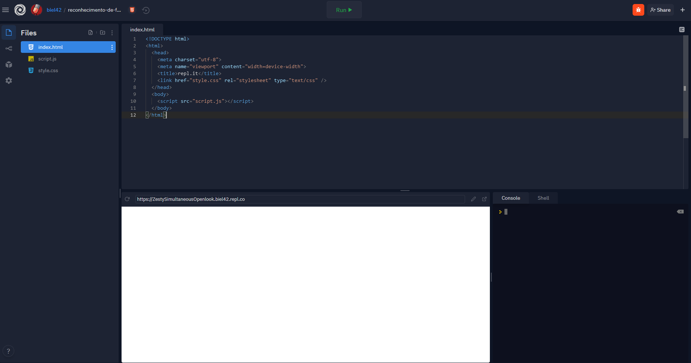
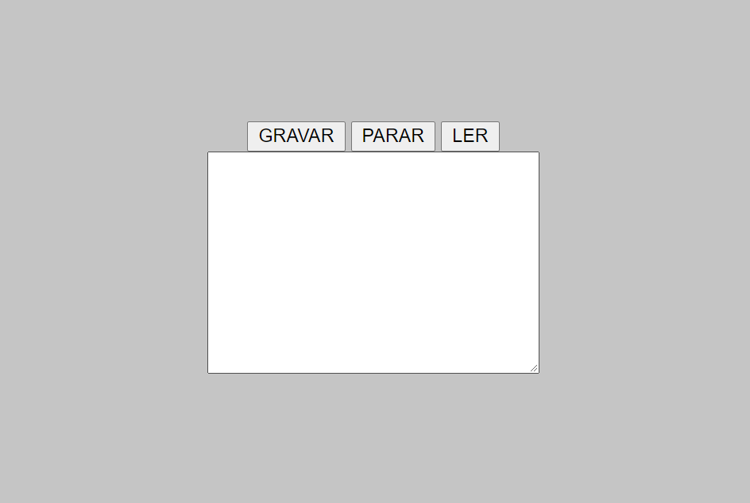
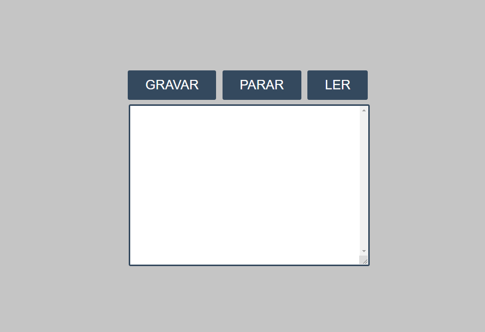

<center>Crie uma aplicação de reconhecimento de fala com JavaScript!</center>  
<center>Feito por <a href="https://github.com/wollygfx" target="_blank" >@wollygfx</a></center>
<center>Traduzido por <a href="https://github.com/gabriellimma" target="_blank" >@gabriellimma</a></center>

<br />

Neste workshop, você aprenderá como fazer um aplicativo de reconhecimento da fala em apenas 20 minutos! Chega mais e olha como é fácil 🚀


[Demonstração ao Vivo](https://reconhecimento-de-fala.biel42.repl.co/)
<br>
[Código fonte](https://repl.it/@biel42/reconhecimento-de-fala)

*Nota: Este workshop só funciona no Google Chrome no momento. Você também vai precisar de um computador que tenha um microfone.*

## Configurando

Este workshop requer um conhecimento muito básico de HTML e JavaScript. Não se preocupe se você ficar confuso em algum ponto do workshop, tudo será explicado da melhor maneira para que você entenda!

Nesse workshop nós vamos usar o [Repl.it](https://repl.it/), um editor de código gratuito, Clique [aqui](https://repl.it/languages/html) pra iniciar um projeto novo em HTML no repl.it.

(é só escolher um nome, e clicar em "Create repl")



## HTML

Quando seu repositório no repl.it iniciar, você deve ver o arquivo `index.html`. Se não, navegue até esse arquivo na barra lateral à esquerda.

A primeira coisa que precisamos fazer é criar um contêiner `div` com a classe `container-principal` com mais 2 elementos `div` dentro. O primeiro contêiner `div` terá 3 elementos de `button` dentro e o segundo terá um elemento de `textarea`. Coloque tudo isso entre as tags `<body>` `/body>`.

Veja como será seu `<body>` HTML depois de fazer isso:

``` html
<body>
  <div class="container-principal">
    <div>
      <button id="botaoComecaGravar">GRAVAR</button>
      <button id="botaoParaGravar">PARAR</button>
      <button id="lerTexto">LER</button>
    </div>

    <div>
      <textarea id="texto" cols="30" rows="10"></textarea>
    </div>
  </div>
  <script src="script.js"></script>
</body>
```

- Utilizando a tag `<div>`, estamos criando um container, no qual os botões `GRAVAR`, `PARAR` e `LER` vão estar dentro.
- Cada botão terá um `id` que nos permitirá trabalhar com nossos botões mais tarde em JavaScript.
- Estamos criando um elemento `<textarea>`, no qual todo o texto (falado) estará dentro.
- O elemento `<script>` está ligando nosso arquivo JavaScript com nosso documento HTML. 

Este é o resultado do código acima:


Boa! Este é todo o HTML que precisamos escrever. Agora, vamos acrescentar um pouco de estilo.

## CSS

Navegue até o arquivo `style.css`.

Primeiro, vamos dar ao nosso site uma cor de fundo:

```css
body {
  background: #c5c5c5;
}
```

Em seguida, queremos centralizar o `container-principal` vertical e horizontalmente na página.

```css
.container-principal {
  display: flex;
  flex-direction: column;
  justify-content: center;
  align-items: center;
  height: 100vh;
}
```

Vamos entender melhor isso:
- A propriedade `display` define se um elemento é tratado como um elemento em blocos ou em linha e o layout utilizado para seus filhos, como layout de flow, grid ou flex. <a href="https://pt-br.learnlayout.com/display.html" target="_blank">veja mais</a>
- A propriedade `flex-direction` define como os itens flexíveis serão colocados no `flex-container` definindo o eixo principal e a direção (normal ou inversa).  <a href="https://www.w3schools.com/cssref/css3_pr_flex-direction.asp" target="_blank">veja mais (inglês)</a>
- A propriedade `justify-content` define como o navegador distribui o espaço entre e ao redor dos itens de conteúdo ao longo do eixo principal de um `flex-container`, e o eixo em linha de um `grid-container`.
- A propriedade `align-items` define o valor do alinhamento-próprio em todas os seus filhos diretos como um grupo.

Veja como nosso site está até agora:



E finalmente, vamos dar estilo aos elementos `button` e `textarea`.

```css
button {
  background-color: #34495E;
  color: #fff;
  font-size: 15px;
  padding: 8px 20px;
  margin: 0 3px 5px 0;
  border: 0;
  border-radius: 2px;
  cursor: pointer;
}

#texto {
  border: 2px #34495E solid;
  border-radius: 2px;
  overflow-y: scroll;
}
```

Vamos entender melhor:

- As propriedades `background-color`, `color` and `font-size` dão aos botões uma cor de fundo, uma cor para o texto e um tamanho para o texto, respectivamente.
- As propriedades `padding` e `margin` fazem parte do  [modelo CSS box (em inglês)](https://www.w3schools.com/css/css_boxmodel.asp).
- As propriedades `border` e `border-radius` permitem especificar o estilo, largura e cor da borda de um elemento e definir o raio dos cantos do elemento, respectivamente.
- A propriedade `cursor` define o tipo de cursor do mouse, se houver, para mostrar quando o ponteiro do mouse estiver sobre os botões.
- A propriedade `overflow-y` define o que será mostrado quando o conteúdo ultrapassar as bordas superior e inferior de um elemento de nível de bloco. Isto pode não acontecer se nenhum conteúdo ultrapassar o topo ou a parte de baixo. Ou se torna, se acontecer, uma barra de rolagem para o conteúdo que ultrapassou.

Finalmente, aqui está nosso site depois de adicionar o CSS:



## JavaScript

Agora que já estilizamos nossa página, vamos escrever um pouco de JavaScript! Navegue até o arquivo `script.js`.

Primeiro, vamos precisar pegar os botões do nosso documento HTML e depois atribuí-los às seguintes variáveis:

```js
const botaoComecaGravar = document.getElementById('botaoComecaGravar');
const botaoParaGravar = document.getElementById('botaoParaGravar');
const botaoLerTexto = document.getElementById('lerTexto');  
const texto = document.getElementById('texto');
```

Vamos entender melhor:

- Ao usar o método `document.getElementById()`, estamos obtendo os elementos no documento (HTML) que têm os IDs correspondentes.
- E nós mantemos esses elementos capturados por ID's em variáveis [constantes (em inglês)](https://www.w3schools.com/js/js_const.asp).
    
A próxima coisa a se fazer é definir uma instância de reconhecimento de fala para controlar o reconhecimento de fala da nossa aplicação. Para fazer isso, utilizaremos o construtor `webkitSpeechRecognition()`.

```js
let reconhecimento = new webkitSpeechRecognition();
```

Agora nós podemos controlar a maneira que o contrutor de reconhecimento de fala funciona:

```js
reconhecimento.lang ='pt-BR'
reconhecimento.continuous = true;
reconhecimento.interimResults = false;    
```

- O `reconhecimento.lang` é utilizado para definir uma linguagem para o reconhecimento da fala. [Aqui](http://www.lingoes.net/en/translator/langcode.htm), você pode encontrar uma tabela que contém códigos de linguagem todas as linguagens suportadas.
- `recognition.continuous` é utilizado para definir se o microfone gravará contínuamente ou não.
- `recognition.interimResults` é utilizado para definir se o reconhecimento da fala mostra os resultados imediatamente ou uma vez que o reconhecimento da fala reconhece uma frase inteira. Podemos deixá-lo como falso, porque é mais preciso.
    
A próxima coisa que vamos fazer é devolver os resultados que o aplicativo de reconhecimento de fala obteve:

```js
reconhecimento.onresult = (evento) => {
  const resultados = evento.results;
  const sentenca = resultados[resultados.length - 1][0].transcript;
  texto.value += sentenca;
} 
```

- A propriedade `onresult` da interface SpeechRecognition representa um manipulador de eventos que será executado quando o serviço de reconhecimento de fala retornar um resultado - uma palavra ou frase que foi positivamente reconhecida e isto será comunicado de volta ao aplicativo.
- A variável `resultados` obtém os valores retornados, ela tem um getter para que possa ser acessada como uma matriz.
- A variável `sentenca` pega a variável `resultados` e acessa os itens [resultados.length - 1] e [0], e então transcreve esses itens.
- Finalmente, `texto.value += sentenca;` obtém o valor do texto do elemento e então utilizando o operador de atribuição `+=`, adicionamos o resultado obtido ao texto atual.

Agora, vamos criar um evento que mostra uma mensagem quando o reconhecimento da fala terminar.

```js
reconhecimento.onend = (evento) => {
  console.log('A gravação do microfone foi encerrada');
}
```

- O `console.log` é uma função que escreve uma mensagem para **log** no **console** de debug.
- `reconhecimento.onend` é um evento que executa determinado código quando o reconhecimento da fala termina.

E vamos criar outro evento que será mostrado se ocorrer um erro.

```js
reconhecimento.onerror = (evento) => {
  console.log(evento.error)
}
```

- `reconhecimento.onerror` executa determinado código quando ocorre um erro.
- `console.log (evento.error)` escreve no console o erro ocorrido.

Agora, faremos os botões funcionarem quando forem clicados.

```js
botaoComecaGravar.addEventListener('click', () => {
  reconhecimento.start();
});
botaoParaGravar.addEventListener('click', () => {
  reconhecimento.abort();
});
botaoLerTexto.addEventListener('click', () => {
  lerTexto(texto.value);
});
```

- O método **`addEventListener()`** configura uma função que será chamada sempre que o evento `click` (clique) for acionado nos botões.
- O evento `recognition.start()` inicia o aplicativo de reconhecimento de voz.
- O `recognition.abort();` para o aplicativo de reconhecimento de voz.
- No terceiro `addEventListener`, estamos chamando a função `lerTexto()` que criaremos.

A última coisa que faremos é criar uma função que leia o texto obtido a partir do aplicativo de reconhecimento de fala.

```js
function lerTexto(texto) {
  const leitura = new SpeechSynthesisUtterance();
  leitura.text = texto;
  leitura.volume = 1;
  leitura.rate = 1;
  leitura.pitch = 1;
  window.speechSynthesis.speak(leitura);
}
```

Vamos entender melhor:

- Primeiro estamos criando um objeto chamado `SpeechSynthesisUtterance`. Ele contém o conteúdo que o serviço de fala deve ler e informações sobre como lê-lo.
- `leitura.text` define qual texto será lido, neste caso será o texto dentro do elemento `<textarea>` no nosso documento.
- A propriedade `leitura.volume` recebe e define o volume em que o texto será lido.
- A propriedade `leitura.rate` recebe e define a velocidade na qual a fala será proferida.
- A propriedade `leitura.pitch` define a velocidade na qual a fala será proferida.
- E a linha de código `window.speechSynthesis.speak(leitura);` faz com que a síntese da fala comece a falar.

### Executando o programa

Muito bem, vamos testá-lo! Clique no botão verde "Run" no topo do seu repl para executar o programa. Eu recomendo abrir a visualização em uma nova aba. Se tudo correr bem, o Google Chrome irá solicitar que você permita o acesso ao microfone. Permita o acesso ao seu microfone. Então, fale em com seu computador!

Se não funcionar, passe pelo seu código linha por linha e tente ver se você consegue encontrar o que deu errado. Se você estiver confuso, pergunte ao líder do seu clube ou para um HackClubber da comunidade no [Discord](https://discord.gg/xZmn84EtPk).


Aqui está o código final em JS:

```js
const botaoComecaGravar = document.getElementById('botaoComecaGravar');
const botaoParaGravar = document.getElementById('botaoParaGravar');
const botaoLerTexto = document.getElementById('botaoLerTexto');  
const texto = document.getElementById('texto');

let reconhecimento = new webkitSpeechRecognition();

reconhecimento.lang = 'pt-BR'
reconhecimento.continuous = true;
reconhecimento.interimResults = false;

reconhecimento.onresult = (evento) => {
  const resultados = evento.results;
  const sentenca = resultados[resultados.length - 1][0].transcript;
  texto.value += sentenca;
} 

reconhecimento.onend = (evento) => {
  console.log('A gravação do microfone foi encerrada');
}

reconhecimento.onerror = (evento) => {
  console.log(evento.error)
}

botaoComecaGravar.addEventListener('click', () => {
  reconhecimento.start();
});

botaoParaGravar.addEventListener('click', () => {
  reconhecimento.abort();
});

botaoLerTexto.addEventListener('click', () => {
  lerTexto(texto.value);
});

function lerTexto(texto) {
  const leitura = new SpeechSynthesisUtterance();
  leitura.text = texto;
  leitura.volume = 1;
  leitura.rate = 1;
  leitura.pitch = 1;
  window.speechSynthesis.speak(leitura);
}
```


## Hackeando
Boooa!! você conseguiu chegar ao final deste workshop. Sei que este foi um workshop bem simples, mas você ainda pode fazer coisas bem complexas... Deixe-me te dar algumas ideias

- Use [condições IF](https://www.devmedia.com.br/javascript-if-else-criando-scripts-com-estruturas-condicionais/39686) para fazer alguma coisa quando o aplicativo de reconhecimento de fala retornar o texto corretamente.
- Crie um aplicativo que toque, pare e pule músicas.
- Estilize seu aplicativo para que ele pareça (mais) legal.

Aqui estão algumas demonstrações feitas por outros Clubbers:

- [Um aplicativo que leva você a um dos menu do site pela sua voz](https://codepen.io/Rumyra/pen/bCphe)
- [Aplicativo que compara uma frase dita com a frase que ele pede que você diga](https://mdn.github.io/web-speech-api/phrase-matcher/)
- [Esta demonstração muda a cor de fundo do site quando uma cor é reconhecida](https://mdn.github.io/web-speech-api/speech-color-changer/)

Agora que você terminou de construir este maravilhoso projeto, compartilhe sua bela criação com outras pessoas! Lembre-se, é só mandar a URL do seu projeto!

Você provavelmente conhece as melhores maneiras de entrar em contato com seus amigos e familiares, mas se você quiser compartilhar seu projeto com a comunidade brasileira do Hack Club, não há melhor lugar para fazer isso do que no Discord do Hack Club Brasil.✨

1. Clique [aqui][discord]{:target="_blank"} para fazer parte da nossa comunidade!
2. Depois, poste o link do seu projeto no canal `💡┇criações` para compartilhá-lo com todos os HackClubbers!

A comunidade te espera!🎉🎉

[discord]: http://bit.ly/discord-hc-brasil
