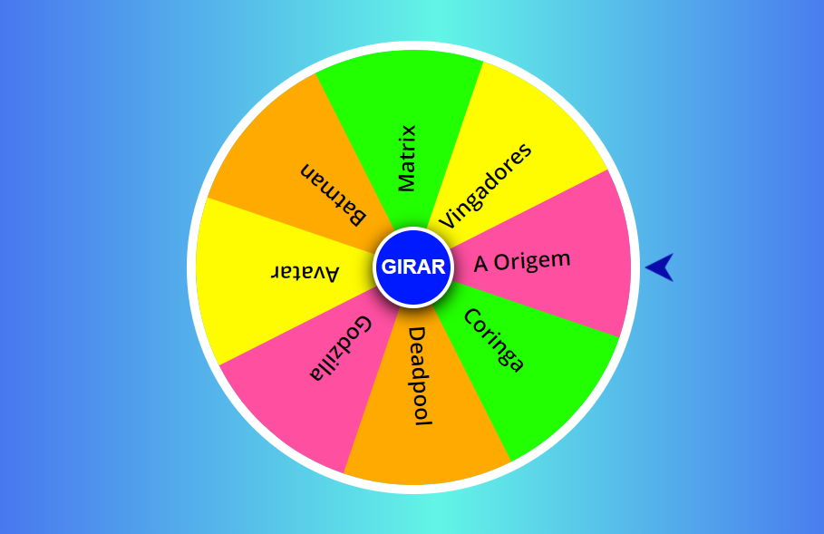
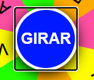
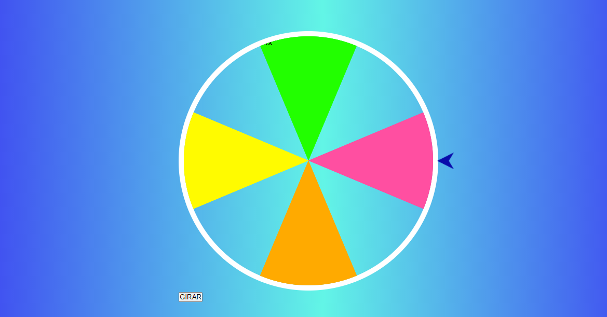
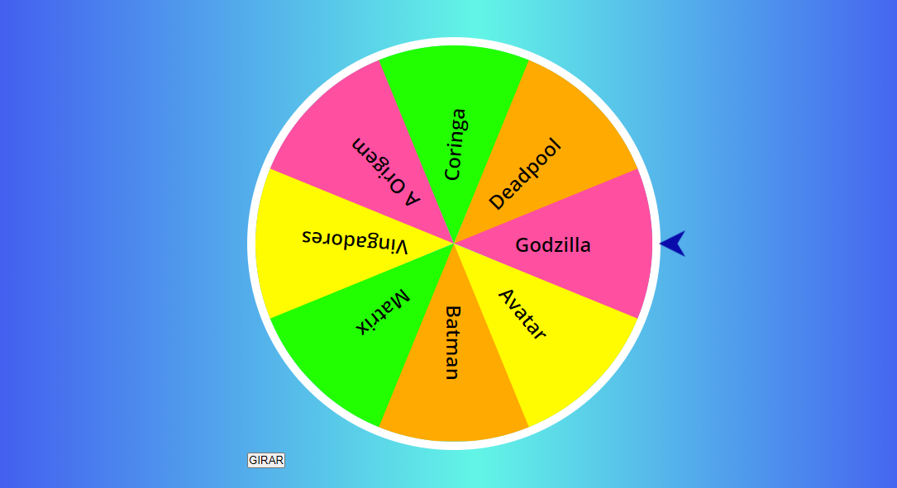
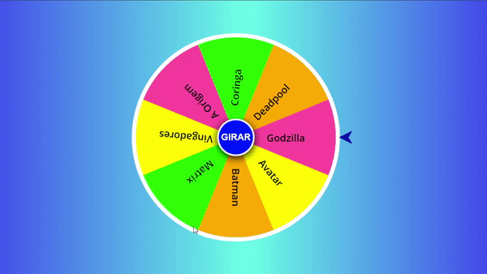

<center>Faça uma roda giratória colorida com HTML, CSS e JavaScript</center>  
<center>Feito por <a href="https://github.com/HariOm987" target="_blank">@HariOm987</a></center>
<center>Traduzido por <a href="https://github.com/vitorvavolizza" target="_blank">@vitorvavolizza</a></center>

<br />

Neste workshop, você vai fazer uma roda giratória colorida com seu próprio conteúdo personalizado, em 20 minutos!

Aqui está a [demonstração ao vivo](https://roda-a-roda.vitorvavolizza.repl.co/) e o [código final](https://repl.it/@VitorVavolizza/roda-a-roda).



^^^ Se você seguir este workshop estritamente, você fará algo como a imagem acima, mas sinta-se livre para utilizar sua imaginação para personalizar o projeto completamente e você acabará com algo ainda mais mais legal. Então, vamos começar. 😁✨

## Parte 1: Pré-requisitos

- Ter uma conta no Repl.it
- Conhecimento básico de HTML, CSS e JavaScript seria bom, mas não é necessário.

## Parte 2: Configuração

### Configurando nosso ambiente de código

Neste workshop, usaremos o repl.it, um editor de código online gratuito.

Você pode começar indo para [repl.it/languages/html](https://repl.it/languages/html). Você vai cair diretamente na página onde escreveremos nosso código.


^ Neste momento, sua página terá este aspecto.

## Parte 3: Inspecionando os arquivos padrão

Aqui do lado esquerdo, na seção de arquivos, você verá 3 arquivos:

1. index.html
2. script.js
3. style.css

Agora vamos dar uma olhada neles e tentar entendê-los individualmente.

### 1) O arquivo HTML

O HTML dá a estrutura para nossa página web. Aqui na primeira linha, temos `<!DOCTYPE html>` que é utilizado para especificar a versão do HTML que o documento está utilizando. Em seguida, temos a tag `<title>` que especifica o título de nossa página web que será mostrado na aba do site. Em seguida, temos a tag `<body>` que contém a parte principal visível de nossa página da web. Certifique-se de que todo o código que você escreve esteja incluído entre as tags de abertura e fechamento. ( `<body></body>` )

Certifique-se de remover a linha 5 (`<meta name="viewport" content="width=device-width">`) que pode causar alguns problemas estranhos em nosso workshop.


### 2) O arquivo CSS

Este é o arquivo `style.css` em seu diretório. Ele define a aparência de nosso website. Quaisquer que sejam os estilos que dermos ao nosso website, eles estarão neste arquivo. Se você der uma olhada na tag `<head>` em seu arquivo HTML, você encontrará uma linha de código (`<link href="style.css" rel="stylesheet" type="text/css" />`). Essa linha significa que seu arquivo HTML está devidamente vinculado ao seu arquivo CSS!

### 3) O arquivo JavaScript

Este é o arquivo `script.js` em seu diretório. Por enquanto está vazio, mas eventualmente o preencheremos através do workshop! O código aqui escrito será responsável pelo funcionamento de nossa roda. Se você der uma olhada na tag `<body>` em seu arquivo HTML, você encontrará uma linha de código (`<script src="script.js"></script>`). Isto significa que seu arquivo HTML está devidamente vinculado ao seu arquivo JavaScript!

## Parte 4: Construindo a Roda

### 1) HTML

Vamos começar a parte de programação do nosso workshop. Aqui escreveremos o código HTML necessário para construir nossa roda.

Faça uma nova seção com a ajuda da tag `<div>` dentro das tags do seu corpo (`<body> </body>`).

Adicione os atributos `id="caixaprincipal"` e `class="caixaprincipal"` dentro desse segmento. A adição dos atributos `id` e `class` dá a este particular `div` seu próprio "nome", o que nos permitirá referenciá-lo diretamente utilizando CSS e JavaScript (como veremos mais adiante neste workshop!).

```html
<div id="caixaprincipal" class="caixaprincipal"></div>
```

A seguir, crie outro div com `id="caixa"` e `class="caixa"`. Coloque ele dentro do div `caixaprincipal`, assim:

```html
<div id="caixaprincipal" class="caixaprincipal">
  <div id="caixa" class="caixa"></div>
</div>
```

Dentro do div `caixa`, crie outro div com a classe `caixa1`. Em seguida, dentro dele, adicione 4 tags `span`, assim:

```html
<div id="caixaprincipal" class="caixaprincipal">
  <div id="caixa" class="caixa">
    <div class="caixa1">
      <span class="span1"></span>
      <span class="span2"></span>
      <span class="span3"></span>
      <span class="span4"></span>
    </div>
  </div>
</div>
```

^^^ Neste momento, suas divisões devem estar parecidas com isto.

As opções em sua roda giratória estarão dentro das tags `span`. Portanto, entre cada tag `span`, adicione as opções que você quiser em sua roda giratória entre tags `<b>` para deixá-las em negrito. Vai fundo!

```html
<span class="span1"><b>Vingadores</b></span>
<span class="span2"><b>Godzilla</b></span>
<span class="span3"><b>Batman</b></span>
<span class="span4"><b>Coringa</b></span>
```

Uma vez feito isso, adicione um `<div class="caixa2">` após seu div `caixa1`, depois copie e cole todos os 4 divs `span` que você já criou e personalize-os assim.👇

```html
<div class="caixa2">
  <span class="span1"><b>Avatar</b></span>
  <span class="span2"><b>A Origem</b></span>
  <span class="span3"><b>Deadpool</b></span>
  <span class="span4"><b>Matrix</b></span>
</div>
```

Agora que criamos todas as nossas opções, precisamos acrescentar um botão que diga `girar`. Para isso, utilize este código antes do final de sua última tag `div`.

```html
<button class="girar" onclick="funcaoGirar()">GIRAR</button>
```

Aqui utilizamos o evento `onclick` que será explicado na parte de JavaScript de nosso workshop.

Aqui está como deve estar seu arquivo HTML no final:

```html
<!DOCTYPE html>
<html>
  <head>
    <title>Seletor de Filmes</title>
    <link href="style.css" rel="stylesheet" type="text/css" />
  </head>
  <body>
    <div id="caixaprincipal" class="caixaprincipal">
      <div id="caixa" class="caixa">
        <div class="caixa1">
          <span class="span1"><b>Vingadores</b></span>
          <span class="span2"><b>Godzilla</b></span>
          <span class="span3"><b>Batman</b></span>
          <span class="span4"><b>Coringa</b></span>
        </div>
        <div class="caixa2">
          <span class="span1"><b>Avatar</b></span>
          <span class="span2"><b>A Origem</b></span>
          <span class="span3"><b>Deadpool</b></span>
          <span class="span4"><b>Matrix</b></span>
        </div>
      </div>
      <button class="girar" onclick="funcaoGirar()">GIRAR</button>
    </div>
    <script src="script.js"></script>
  </body>
</html>
```

Eeeee! Concluímos a parte HTML com sucesso.😍😍

### 2)	CSS
Depois de ter completado a parte HTML, você notará que quando clicar no botão "Run" no topo, você verá apenas uma tela branca com um pouco de texto e um botão que diz "girar".

Agora, vamos adicionar um pouco de estilo.🤩
 
Primeiro, navegue até o arquivo `style.css` em sua barra lateral.

E adicione o seguinte código:

```css
*{
  box-sizing: border-box;
  padding: 0;
  margin: 0;
  outline: none;
}

body{
  font-family: "Open Sans";
  display: flex;
  justify-content: center;
  align-items: center;
  height: 100vh;
  overflow: hidden;
  background: rgb(60, 60, 242);
  background: linear-gradient(90deg, rgba(60, 60, 242, 1) 0%, rgba(98, 245, 230, 1) 52%, rgba(60, 60, 242, 1) 100%);
  background-size: cover;
}
```

### Explicação: 
Na linha número `2`, demos o tamanho do container (triângulos de nossa roda). Em seguida, na linha de número `3 & 4`, o preenchimento e a margem entre eles é marcada como `0` separadamente, pois não necessitamos de espaço entre os triângulos. Na linha número `4`, o contorno (outline) é marcado como `none` (nenhum), pois não necessitamos de borda quando clicamos no botão "girar".



^^^ Se não digitarmos `outline: none`, então, depois de clicar, seu botão terá uma caixa de contorno como esta.


^^^ Se utilizarmos `outline: none`, então nosso botão terá este aspecto (sem nenhuma borda) após clicarmos.

Agora no próximo bloco (linha `9`), temos `font-family': Open Sans;` esta sintaxe é utilizada para dar o `nome` da fonte que queremos ter em nosso bloco. 

Mudamos a exibição padrão `display: block` (padrão) para `display: flex`. Uma razão muito boa para isso é porque o flex permite que você alinhe perfeitamente seus itens ao centro! E foi isso que fizemos nas próximas duas linhas.

Na linha `11`, marcamos `justify-content: center;`. A propriedade justify-content alinha todos os elementos de seus filhos ao centro, mas verticalmente.
 
Na linha `12`, marcamos `align-items: center;`. A propriedade align-itens alinha todos os elementos de seus filhos ao centro, mas horizontalmente. 

Em seguida, temos a propriedade `min-height` que estabelece uma altura mínima de `100vh` (altura do porto de visão) para seu `<body>`. A propriedade `min-height` funciona em conjunto com a propriedade `align-items` e ajuda os elementos filhos a se alinharem corretamente ao centro.

Saiba mais sobre as viewport-heights (janelas de visualização) [aqui](https://www.sitepoint.com/css-viewport-units-quick-start/).

Nas linhas `15` e `16` (seção do fundo), você pode utilizar qualquer código hexadecimal ou gradiente de cor. Você pode criar o gradiente neste [site](https://cssgradient.io/).

Para fazer seu gradiente, basta navegar até esse website e projetar seu gradiente arrastando os marcadores. Quando estiver satisfeito com sua criação, então copie o código dado abaixo e cole na seção de fundo. Com isso, seu fundo personalizado será aplicado.


Agora, adicione o seguinte código abaixo do bloco do body.

```css
.caixaprincipal{
  position: relative;
  width: 500px;
  height: 500px;
}
.caixaprincipal:after{
  position: absolute;
  content: '';
  width: 32px;
  height: 32px;
  background: url('arrow-left.png') no-repeat;
  background-size: 32px;
  right: -30px;
  top: 50%;
  transform: translateY(-50%);
}
.caixa{
  width: 100%;
  height: 100%;
  position: relative;
  font-weight: bold;
  border-radius: 50%;
  border: 10px solid #fff;
  overflow: hidden;
  transition: all ease 5s;
}
```

### Explicação: 
Aqui, antes de mais nada, demos as dimensões da roda do bloco `.caixaprincipal`.

Em seguida, no segundo bloco que é `.caixaprincipal:after`, inserimos a imagem da seta (certifique-se de mudar a URL da imagem da seta com `arrow-left.png` para um link de uma imagem) e definimos sua posição que apontará para a opção aleatória. 

Chegando ao terceiro bloco, aqui desenhamos o círculo com uma borda de `10px` e um raio de `50%`. A cor do círculo é `#fff` que é branco (você pode mudá-la se desejar). Na última linha está a propriedade `transition` - ela será explicada mais tarde durante este workshop.

Agora adicione o código abaixo:

```css
span{
  width: 50%;
  height: 50%;
  display: inline-block;
  position: absolute;
}
.span1{
  clip-path: polygon(0 92%, 100% 50%, 0 8%);
  background-color: #fffb00;
  top: 120px;
  left: 0;
}
.span2{
  clip-path: polygon(100% 92%, 0 50%, 100% 8%);
  background-color: #ff4fa1;
  top: 120px;
  right: 0;
}
.span3{
  clip-path: polygon(50% 0%, 8% 100%, 92% 100%);
  background-color: #ffaa00;
  bottom: 0;
  left: 120px;
}
.span4{
  clip-path: polygon(50% 100%, 92% 0, 8% 0);
  background-color: #22ff00;
  top: 0;
  left: 120px;
}
```

Aqui fizemos os triângulos que estão presentes no círculo. E para fazer os triângulos usamos `polygon(valores)`. Para obter os valores, utilizamos este [site](https://bennettfeely.com/clippy/). Ele fornece a forma e a orientação do polígono.

Depois, replicamos o `span1` mais três vezes e mudamos os nomes para `span2`, `span3`, e `span4` respectivamente. Também mudamos o valor da cor porque queremos cores de fundo diferentes e o caminho do polígono também é mudado porque estamos procurando orientações diferentes a cada momento.



^^^ Neste momento, nossa página web terá este aspecto. Aqui o triângulo com a cor **amarelo** é formado por `span1` e **verde**, **rosa** e **laranja** são formados por `span2`, `span3`, e `span4` respectivamente. 

Mas ainda assim, temos apenas 4 triângulos, Agora para preencher o espaço em branco, podemos criar mais triângulos com a orientação necessária ou podemos simplesmente girar esses 4 triângulos e preencher os espaços.

Vamos girar os triângulos. Portanto, acrescente este código:

```css
.caixa1 .span3 b{
   transform: translate(-50%, -50%) rotate(-270deg);
}
.caixa1 .span1 b,
.caixa2 .span1 b{
  transform: translate(-50%, -50%) rotate(185deg);
}
.caixa2 .span3 b{
  transform: translate(-50%, -50%) rotate(90deg);
}
.caixa1 .span4 b,
.caixa2 .span4 b{
  transform: translate(-50%, -50%) rotate(-85deg);
}

span b{
  font-size: 24px;
  position: absolute;
  top: 50%;
  left: 50%;
  transform: translate(-50%, -50%);

}

.caixa2{
  width: 100%;
  height: 100%;
  transform: rotate(-135deg);
}
```

Aqui nos primeiros 4 blocos, giramos as posições de nosso texto com o grau requerido e nos 5 blocos, fixamos sua posição dentro do triângulo. Em seguida, no sexto bloco, giramos todos os triângulos em `-135` graus para a caixa 2, como referido no arquivo HTML.

Após isso, estamos na metade da estrutura da roda!



^^^ Neste momento, sua página web terá um aspecto semelhante a este - mas o botão "girar" parece desligado.

Vamos consertar isso. Adicione este código:

```css
.girar{
  position: absolute;
  top: 50%;
  left: 50%;
  transform: translate(-50%, -50%);
  width: 90px;
  height: 90px;
  border-radius: 50%;
  border: 4px solid #fff;
  background-color: #001aff;
  color: #fff;
  box-shadow: 0 5px 20px #000;
  font-weight: bold;
  font-size: 22px;
  cursor: pointer;
}
.girar:active{
  width: 85px;
  height: 85px;
  font-size: 20px;
}

.caixaprincipal.animate:after{
  animation: animarFlecha 0.7s ease infinite;
}
@keyframes animarFlecha{
  50%{
    right: -40px;
  }
}
```

Aqui apontamos nosso seletor CSS para o botão girar, pois atribuímos ao nosso botão no arquivo HTML a `classe` `girar`. Marcamos sua posição no centro nas primeiras 4 linhas, depois nas próximas linhas restantes daquele bloco, formamos o círculo e editamos algumas propriedades como `height` (altura), `width` (largura), `border` (borda), `background-color` (cor de fundo), `shadows` (sombras), `font-weight` (peso da fonte), `font-size` (tamanho da fonte), e por último, na propriedade `cursor`, demos o valor de `pointer` (ponteiro) para que quando passarmos o cursor sobre aquele botão, nosso cursor se transformará em um ponteiro.
 
No segundo bloco de nosso código que é `.girar:active` , diminuímos o tamanho do círculo e da fonte enquanto pressionamos nosso cursor sobre o botão para dar-lhe uma aparência realista.
 
No terceiro bloco, temos o seletor `.caixaprincipal` (utilizamos ele anteriormente para a seta que aponta para a esquerda), portanto, as propriedades que serão editadas neste bloco afetarão esta seta. Aqui aplicamos a animação à seta pela qual ela avançará e retrocederá a cada 0,7 segundos até que a página da web seja aberta e a roda pare. Neste momento, ela não se moverá.

Agora, nossa página da web terá o seguinte aspecto 👇


Terminamos a parte do CSS. Mas mesmo assim, não está funcional, pois ainda não adicionamos nenhum trecho de JavaScript.

### O que fizemos até agora:
* Construímos a estrutura da roda com HTML.
* Construímos a exibição da roda com CSS.

Agora com JavaScript, vamos construir a funcionalidade da roda.

# 3) JavaScript 

Vá para o arquivo `script.js` e vamos começar a fazer nossa roda funcionar.

 
 
Antes de tudo, vamos escrever:

```javascript
function funcaoGirar(){

}
```

Você se lembra que eu mencionei que explicaria a razão de colocar `onclick=funcaoGirar()` mais tarde neste tutorial enquanto estávamos no arquivo HTML? 

Agora é a hora de escrever o código para a `funcaoGirar()`!

Aqui acima escrevemos o código em branco para o evento `onclick`, pois agora vamos colocar mais um pouco de código que funcionará quando o usuário clicar no botão `girar`.

#### Passos simples para nosso objetivo:
* Crie a variável `min` e dê o valor mínimo de 1024 (`var min = 1024;`)
* Crie outra variável `max` e dê o valor máximo de 9999 (`var max = 9999;`)
* Crie uma variável `graus` e escreva este código: (`var graus = Math.floor(Math.random() * (max - min)) + min;`). Esta linha gerará um valor entre o mínimo e o máximo.
* Agora encontre um elemento com o id "caixa" e depois mude seu estilo de `transform` (transformação) com os graus que obtivemos na variável `graus`. 

#### Para almas curiosas:
1. `Math.random()` gera um número aleatório entre 0 e 1.
2. Multiplicando por (`max`-`min`) nos dará um número entre 0 e (`max`-`min`) -> (**Aumentando a faixa**).
3. Adicionar `min` colocará o valor entre **min** e **max**. -> (**Ajustando a faixa**).
4. Fazer um `Math.floor()` com o resultado, nos dará um inteiro com o resultado arredondado.

Agora nosso código teve estar assim 👇

```javascript
function funcaoGirar(){
  var min = 1024;
  var max = 9999;
  var graus = Math.floor(Math.random() * (max - min)) + min;
  document.getElementById('caixa').style.transform = "rotate("+graus+"deg)";
}
```   

## O que fizemos até agora:
* Projetamos a roda em CSS e acrescentamos o botão `girar`.
* Inserimos o texto nas colunas da roda.
* Inserimos animação para girar a roda.

Completamos todas as peças básicas para fazer nosso projeto rodar.🥳🥳🥳

Mas se você quiser aprender mais algumas coisas incríveis, prossiga.

Agora vamos fazer a `flecha` mover-se depois que a roda for parada.

Para isso, primeiro vamos obter o elemento com Id `caixaprincipal` e depois armazená-lo em uma variável `elemento`. Em seguida, removeremos a classe `animate` desse elemento. Para isso, vamos digitar: `elemento.classList.remove('animate');`. A propriedade `classList` retorna o nome da(s) classe(s) de um elemento, como um objeto `DOMTokenList`. Esta propriedade é útil para adicionar, remover e alternar classes CSS em um elemento. Nas próximas linhas, removeremos a animação enquanto a roda está girando.

```javascript
  // Código que escrevemos antes...
  var elemento = document.getElementById('caixaprincipal');
  elemento.classList.remove('animate');
```

Agora adicionaremos a animação à seta após 5 segundos a partir do momento em que a pessoa clicou no botão `girar`. Para isso, utilize este código:

```javascript
  // Código que escrevemos antes...
  //...
  setTimeout(function(){
    elemento.classList.add('animate');
  }, 5000);
```

### Explicação:
O método `setTimeout()` chama uma função ou avalia uma expressão após um número especificado de milissegundos. Aqui adicionamos a animação à seta após 5000 milissegundos. (`1000 milissegundos = 1 segundo`).

Em geral, como tudo isso está dentro do bloco `funcaoGirar()` que utilizamos no botão **`girar`**, tudo isso só funcionará depois que tivermos clicado no botão **`girar`**.
 
Entãão, terminamos com a programação em JavaScript!

## Parabéns!


Conseguimos! Agora nossa roda está incrível! 🎉 🎉 🎉

# Parte 5: Hackeando

Aqui estão algumas coisas que você pode fazer:

* Tente mudar o gradiente de fundo.
* Tente adicionar mais algumas opções à roda
* Tente fazer um jogo que use a roda.
* Tente exibir o nome da opção separadamente.

* Exemplos de projetos de outros hackclubbers:
  * [Vivek](https://roda-a-roda-1.vitorvavolizza.repl.co/)
  * [Samuel](https://jsfiddle.net/d8m2jvf0/2/)

**Happy Hacking!! :)**